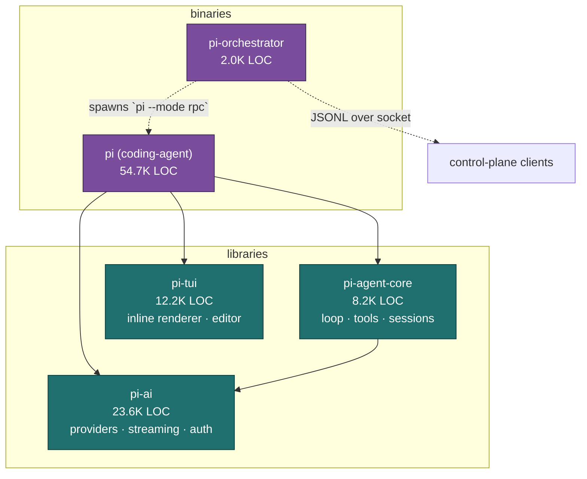

# Pi → Rust Port: Master Analysis & Architecture Report

> Source of truth for the `pirust` project: an exact 1:1 functional replica of the
> **Pi Agent Harness** (`pi_space/pi`, ~100K LOC TypeScript) in Rust.
> Per-package deep dives: [01-agent](01-agent.md) · [02-ai](02-ai.md) ·
> [03-coding-agent](03-coding-agent.md) · [04-orchestrator](04-orchestrator.md) ·
> [05-tui](05-tui.md).

## 1. What Pi Is

Pi is a **self-extensible, multi-provider coding-agent CLI**. A user runs `pi` in a
terminal; it starts an interactive TUI, streams an LLM turn, lets the model call
built-in tools (read/write/edit files, run bash, search), and loops until the task
is done. It speaks to ~35 LLM providers behind one normalized API, persists sessions
as an append-only tree (branch/fork/resume/compact), loads arbitrary user extensions
in-process, and can also run headless (print / JSON / JSON-RPC) or be supervised as a
fleet of worker processes by an orchestrator daemon.

The monorepo is lockstep-versioned (all packages share one version, currently 0.80.x).

## 2. System Architecture



**Dependency direction** (drives port order): `ai` depends on nothing internal →
`agent-core` depends on `ai` → `tui` is independent → `coding-agent` depends on all
three → `orchestrator` spawns `coding-agent` as child processes and shares only the
RPC protocol types.

## 3. Components at a Glance

| Package | Role | LOC | Depends on | Hardest port problem |
|---|---|---|---|---|
| **ai** | Unified LLM API: `Model.api` (10 wire adapters) × `Model.provider` (~35 hosts), streaming union, auth/OAuth, generated model catalog | 23.6K | — | Generated catalog build step; provider quirks (SigV4, cache math); conditional generics |
| **agent-core** | 3-tier runtime: stateless loop fns → stateful `Agent` → `AgentHarness` (sessions, compaction, skills, hooks) | 8.2K | ai | Custom `EventStream`; append-only session tree; UTF-16 token counts; monotonic UUIDv7 layout |
| **tui** | Self-contained TUI: inline **line-diff** ANSI renderer, full Emacs line editor, Kitty/xterm key protocols, Kitty/iTerm images | 12.2K | — | UTF-16 cursor math; port renderer literally (NOT ratatui) |
| **coding-agent** | The shippable `pi` binary: CLI/bootstrap, 7 built-in tools, in-process JS extension system, 3 run modes, config + migrations | 54.7K | agent, ai, tui | **Dynamic JS extension loading (`jiti`)** — no clean 1:1 |
| **orchestrator** | Daemon supervising headless `pi --mode rpc` workers over a filesystem socket; two-layer JSONL protocol; Radius remote presence | 2.0K | (protocol only) | Cross-platform local socket; RPC union modeling |

### Built-in tools (coding-agent `core/tools/`)
`read`, `bash`, `edit`, `write` (active by default); `grep`, `find`, `ls` (off by
default; `grep`/`find` shell out to managed `rg`/`fd` binaries). Each is a
TypeBox-schema `ToolDefinition` with `execute` + TUI `renderCall`/`renderResult`.

## 4. Key Findings (cross-cutting)

1. **Two-level provider split is the elegant core of `ai`.** `Model.api` names a wire
   protocol (10 adapters), `Model.provider` names a host (~35). Dozens of
   OpenAI-compatible hosts reuse one `openai-completions` adapter, differing only by
   `baseUrl` + a ~25-flag `compat` quirk struct. Rust should mirror this exactly with
   an `Api` enum + `Compat` struct, not one struct per provider.

2. **Everything is a discriminated union + a hand-rolled push/pull stream.** Content
   blocks, messages, streaming events (`AssistantMessageEvent`: `start` /
   `*_start|_delta|_end` / `done` / `error`), and session tree entries are all tagged
   unions. Both `ai` and `agent-core` ship a custom `EventStream<T,R>` that is *both*
   an async iterable *and* a final-value promise. → Rust: `#[serde(tag=...)]` enums +
   `tokio::mpsc` (stream) paired with `oneshot` (final value).

3. **UTF-16 indexing is load-bearing and dangerous.** JS `string.length` /
   code-unit offsets appear in three places that affect *behavior*, not just display:
   the TUI editor/autocomplete/paste-marker cursor math, and the token-count heuristic
   that decides session **compaction cut points**. A naive `char`/byte port will drift
   from the original at non-BMP input. Needs a UTF-16-aware rope or explicit offset
   translation.

4. **The extension system is the single biggest fidelity risk.** Extensions are
   arbitrary TypeScript loaded **in-process** via `jiti` dynamic import, exposing a
   ~1,700-LOC API: ~30 lifecycle events, tool/command/shortcut/flag/provider
   registration. Rust has no clean 1:1. Even `plan-mode` ships as an extension.

5. **On-disk formats are a compatibility contract.** `~/.pi/agent/` layout:
   `auth.json`, layered `settings.json` (~45 fields), session JSONL trees, and the
   monotonic UUIDv7 bit layout must be reproduced byte-for-byte if the Rust build is
   to interoperate with existing Pi state / sessions.

6. **The model catalog is generated, not hand-written.** `generate-models.ts` (~80KB)
   fetches provider registries and emits `providers/data/*.json` +
   `models.generated.ts`. Those JSON data files were **absent in the checkout**
   (git-ignored/build-time). The port must reproduce the generator as a separate step
   and load catalogs at runtime via `serde_json`.

7. **The TUI is inline, not alt-screen.** It draws into the normal buffer (output
   scrolls into scrollback) with a line-level differential renderer and
   synchronized-output guards. This is behaviorally incompatible with `ratatui`'s
   alt-screen cell-grid model — the renderer must be ported literally, using
   `crossterm` only as a thin raw-mode/size/Windows-VT syscall shim.

8. **`orchestrator` maps cleanly.** Workers use plain stdio pipes (not Node `fork`
   IPC), so `tokio::process` + piped stdio is a direct fit. Note: **no auto-restart** —
   an unexpected child exit → `error` state and drop; that asymmetry must be preserved.

## 5. Rust Workspace Design

Proposed Cargo workspace (`pirust/`):

All crates use the `pirust-*` naming convention (the Rust port's namespace). The `pi`
names in the right column refer to the original source packages being ported.

```
crates/
  pirust-ai/            # provider layer (mirrors packages/ai/src tree)
  pirust-agent-core/    # agent loop, sessions, harness  (mirrors packages/agent)
  pirust-tui/           # inline renderer + editor        (mirrors packages/tui)
  pirust-tools/         # UI-free tool logic + JSON schemas (extracted from coding-agent)
  pirust-coding-agent/  # the `pirust` binary: CLI, config, extensions, modes
  pirust-orchestrator/  # the `pirust-orchestrator` daemon binary
xtask/                  # build tooling incl. the model-catalog generator
```

**Naming rule:** everything in the Rust implementation is named `pirust*` (crates,
binaries, symbols). The only exception is on-disk data that must stay byte-compatible
with real Pi — e.g. the `~/.pi/agent` config dir and wire identifiers like the
`pi-messages` API id — which keep their original names so the port can interoperate
with existing Pi state.

**Highest-value structural refactor** (flagged by the coding-agent analysis): split
each built-in tool's pure `execute` + JSON schema into a UI-free `pi-tools` crate,
keeping TUI `renderCall`/`renderResult` in the binary. This decouples tool correctness
from the TUI port and lets headless modes land first.

### Dependency mapping (cross-cutting)

| Concern | Pi (npm) | Rust crate |
|---|---|---|
| Async runtime | Node event loop | `tokio` |
| HTTP client | `fetch` / SDKs | `reqwest` (rustls) |
| JSON | `JSON` | `serde` + `serde_json` |
| JSON Schema | `typebox` | `schemars` + `jsonschema` (+ `serde_json::Value`) |
| Streaming events | custom `EventStream` | `tokio::mpsc` + `oneshot` |
| Cancellation | `AbortSignal` | `tokio_util::sync::CancellationToken` |
| SSE decode | hand-rolled | `eventsource-stream` or hand-rolled |
| Lenient JSON | `partial-json` + `repairJson` | port `repairJson` by hand |
| Child processes | `child_process` | `tokio::process` |
| Local socket IPC | `node:net` unix/pipe | `interprocess` (cfg-split) |
| Terminal syscalls | hand-rolled + native addons | `crossterm` (thin) + cfg-gated FFI |
| Unicode width/seg | `get-east-asian-width`, `Intl.Segmenter` | `unicode-width`, `unicode-segmentation`, `unicode-properties` |
| Markdown | `marked` | `pulldown-cmark` |
| Bedrock | `@aws-sdk/client-bedrock-runtime` | `aws-sdk-bedrockruntime` (SigV4) |
| WebSocket (Codex) | `ws` | `tokio-tungstenite` |
| YAML / gitignore | `yaml`, `ignore` | `serde_yaml`, `ignore` |
| Errors | thrown values | `thiserror` (lib) / `anyhow` (bin) |
| UUID | custom UUIDv7 | `uuid` + **custom bit-layout port** |
| Base64 | builtin | `base64` |

### Extension system — DECIDED: Rust-native, two loading models

Extensions are written in **Rust**, not emulated TS. A `pi-extension-api` crate mirrors
Pi's host surface (~30 lifecycle events + tool/command/shortcut/flag/provider
registration) as an `Extension` trait. Two loaders behind one `ExtensionRunner` trait:

1. **Built-in (compile-time)** — bundled extensions (incl. `plan-mode`) compiled into
   the `pi` binary. Lands in P6. This is the "native subset."
2. **Dynamic (runtime, WASM)** — user extensions compiled Rust→WASM, loaded at runtime
   via `wasmtime`/`extism`. Sandboxed (better security posture than Pi's in-process
   `jiti` loading). Lands in P9.

The only behavioral divergence from Pi: authors write Rust-compiled-to-WASM, not `.ts`
files dropped into a directory. Host API is behaviorally identical.

The embedded-JS-engine option (`rquickjs`/`boa`/`deno_core`) is **rejected** — Rust-native
extensions are cleaner and the user opted for Rust throughout.

## 6. Recommended Port Order (phases)

1. **P0 — Workspace scaffold** + `pi-ai` type model (`types.rs`: content/message/
   streaming-event enums, `Model`, `Tool`, `Usage`) — the shared vocabulary.
2. **P1 — `pi-ai` runtime**: one `Api` adapter end-to-end (Anthropic Messages, real
   SSE stream) + api-key auth. Prove streaming + tool-call assembly.
3. **P2 — `pi-agent-core`**: loop, tool pipeline, `EventStream`→channels,
   `AbortSignal`→`CancellationToken`, session tree (JSONL), compaction, UUIDv7.
4. **P3 — `pi-tools`**: the 7 built-in tools (UI-free) + byte-identical JSON schemas.
5. **P4 — headless `pi`**: CLI/args, config + migrations, print/json/rpc modes. First
   runnable binary — no TUI yet.
6. **P5 — `pi-tui`**: literal port of renderer, key engine, line editor.
7. **P6 — interactive `pi`**: wire TUI into coding-agent; extension runner (native
   subset).
8. **P7 — remaining `ai` providers/apis** + catalog generator (`xtask`).
9. **P8 — `pi-orchestrator`**.
10. **P9 — embedded-JS extensions** (optional, if full fidelity required).

## 7. Risk Register

| Risk | Severity | Mitigation |
|---|---|---|
| Dynamic JS extensions | High | Native subset first; embedded JS engine as P9 |
| UTF-16 offset drift (editor + compaction) | High | UTF-16 rope / explicit offset translation; golden tests vs Pi |
| On-disk format incompatibility | Med-High | Byte-diff tests against real `~/.pi` artifacts |
| Generated model catalog absent | Med | Port generator in `xtask`; commit a snapshot |
| Provider quirks (SigV4, cache math, thoughtSignature) | Med | Port per-provider; record-replay HTTP fixtures |
| TUI rendering parity | Med | Literal port; tmux snapshot tests (Pi already uses tmux) |
| Scope (100K LOC) | High | Phased delivery via `feature_list.json`; one phase = many features |

## 8. Verification Strategy

Pi tests against a **faux provider** (no real API keys) via
`packages/coding-agent/test/suite/harness.ts`. The Rust port should build the
equivalent: a mock `Api` adapter returning scripted streaming events, plus
record-replay HTTP fixtures for real providers, plus tmux snapshot tests for the TUI
(mirroring Pi's own interactive test method).
