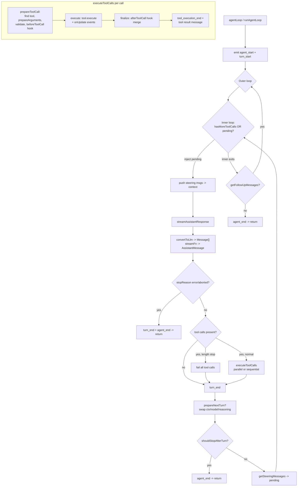

# Package Analysis: `packages/agent` (`@earendil-works/pi-agent-core`)

> Target for an exact 1:1 Rust port. Version `0.80.10`. ~8,200 LOC across ~25 `src` files.
> Source root: `C:\Users\CharikshithPolimera\Downloads\PI_NEW\pi_space\pi\packages\agent`

---

## 1. Purpose & Responsibilities

`pi-agent-core` is the **general-purpose agent runtime** of the Pi harness. It sits on top of the
LLM/provider abstraction in `@earendil-works/pi-ai` and provides everything needed to run an
autonomous tool-calling agent loop, *plus* a batteries-included "harness" that adds sessions,
persistence, compaction, skills, prompt templates and a filesystem/shell execution environment.

There are three layers, from low to high level:

| Layer | Entry point | Responsibility |
|---|---|---|
| **Loop functions** | `src/agent-loop.ts` | Pure, stateless engine. Drives one run: prompt → stream assistant response → execute tool calls → repeat. Emits events. Transforms `AgentMessage[]` → `Message[]` only at the LLM boundary. |
| **`Agent` class** | `src/agent.ts` | Stateful wrapper. Owns transcript/model/tools, lifecycle events, steering & follow-up queues, abort. Thin adapter over the loop functions. |
| **`AgentHarness` class** | `src/harness/agent-harness.ts` | Full application harness. Adds a persistent `Session` (tree of entries), context building, context compaction, branch summarization, skills, prompt templates, hookable events, and a curated stream-options pipeline. Uses `runAgentLoop` directly (not the `Agent` class). |

Supporting subsystems:
- **Session** (`src/harness/session/*`) — an append-only **tree** of typed entries (messages, model/thinking/tools changes, compaction, branch summaries, labels, leaf pointers). Two storage backends: JSONL-on-disk and in-memory.
- **Compaction** (`src/harness/compaction/*`) — summarize old history when the context window fills; also branch summarization when navigating the session tree.
- **Execution environment** (`src/harness/env/nodejs.ts` + `ExecutionEnv` interface) — filesystem + shell abstraction; `NodeExecutionEnv` is the Node implementation (the only Node-coupled file, exported via the `./node` subpath).
- **Resources** — skills (`skills.ts`) and prompt templates (`prompt-templates.ts`) loaded from markdown-with-frontmatter files.
- **Proxy** (`src/proxy.ts`) — a `StreamFn` that routes LLM calls through an HTTP proxy server (SSE) instead of calling providers directly.
- **Utilities** — output truncation (`utils/truncate.ts`), shell capture (`utils/shell-output.ts`), UUIDv7.

The `package.json` (lines 8–17) exports two entry points: `.` (`index.ts`, platform-neutral) and
`./node` (`node.ts`, re-exports `.` plus `NodeExecutionEnv`). The core is deliberately Node-free so
it can run in browsers/workers; only `NodeExecutionEnv` imports `node:*`.

---

## 2. Public API Surface (from `index.ts` / `node.ts`)

`index.ts` re-exports (`export *`) from every module. Everything below is public.

### 2.1 Core loop (`agent-loop.ts`)
- `type AgentEventSink = (event: AgentEvent) => Promise<void> | void`
- `agentLoop(prompts, context, config, signal?, streamFn?) : EventStream<AgentEvent, AgentMessage[]>` — start a run with new prompt messages.
- `agentLoopContinue(context, config, signal?, streamFn?) : EventStream<...>` — resume from existing transcript; throws if empty or if last message is `assistant`.
- `runAgentLoop(prompts, context, config, emit, signal?, streamFn?) : Promise<AgentMessage[]>` — the awaitable form (used by `Agent` and `AgentHarness`).
- `runAgentLoopContinue(context, config, emit, signal?, streamFn?) : Promise<AgentMessage[]>`

### 2.2 `Agent` class (`agent.ts`)
- `interface AgentOptions` — 20 optional fields (initial state, `convertToLlm`, `transformContext`, `streamFn`, `getApiKey`, `onPayload`/`onResponse`, `beforeToolCall`/`afterToolCall`, `prepareNextTurn`/`prepareNextTurnWithContext`, `steeringMode`, `followUpMode`, `sessionId`, `thinkingBudgets`, `transport`, `maxRetryDelayMs`, `toolExecution`).
- `class Agent`:
  - `constructor(options?: AgentOptions)`
  - `subscribe(listener: (event, signal) => Promise<void>|void) : () => void`
  - `get state(): AgentState`
  - `get/set steeringMode`, `get/set followUpMode`
  - `steer(msg)`, `followUp(msg)`, `clearSteeringQueue()`, `clearFollowUpQueue()`, `clearAllQueues()`, `hasQueuedMessages()`
  - `get signal()`, `abort()`, `waitForIdle()`, `reset()`
  - `prompt(text, images?) | prompt(msg|msg[]) : Promise<void>` (overloaded)
  - `continue() : Promise<void>`
  - Public mutable fields mirroring options (`convertToLlm`, `transformContext`, `streamFn`, `getApiKey`, hooks, `sessionId`, `thinkingBudgets`, `transport`, `maxRetryDelayMs`, `toolExecution`).
- Re-exports `type QueueMode`.

### 2.3 Types (`types.ts`)
Exported: `StreamFn`, `ToolExecutionMode`, `QueueMode`, `AgentToolCall`, `BeforeToolCallResult`,
`AfterToolCallResult`, `BeforeToolCallContext`, `AfterToolCallContext`, `ShouldStopAfterTurnContext`,
`AgentLoopTurnUpdate`, `PrepareNextTurnContext`, `AgentLoopConfig`, `ThinkingLevel`,
`CustomAgentMessages` (declaration-merging seam), `AgentMessage`, `AgentState`, `AgentToolResult<T>`,
`AgentToolUpdateCallback<T>`, `AgentTool<TParameters, TDetails>`, `AgentContext`, `AgentEvent`.

### 2.4 Proxy (`proxy.ts`)
- `type ProxyAssistantMessageEvent` (discriminated union of SSE payloads)
- `interface ProxyStreamOptions` (adds `signal?`, `authToken`, `proxyUrl`)
- `streamProxy(model, context, options: ProxyStreamOptions) : ProxyMessageEventStream`

### 2.5 Harness (`harness/agent-harness.ts` + `harness/types.ts`)
- `class AgentHarness<TSkill, TPromptTemplate, TTool>` — see §3.3 for its ~30 methods.
- `harness/types.ts` exports a very large set: `Result<V,E>`/`ok`/`err`/`getOrThrow`/`getOrUndefined`/`toError`; `Skill`, `PromptTemplate`, `AgentHarnessResources`; stream-option types; error classes `FileError`, `ExecutionError`, `CompactionError`, `BranchSummaryError`, `SessionError`, `AgentHarnessError` (each with a stable `code` enum); `FileInfo`, `FileKind`, `FileSystem`, `Shell`, `ShellExecOptions`, `ExecutionEnv`; the full `SessionTreeEntry` union and each variant; `SessionContext`, `SessionMetadata`/`JsonlSessionMetadata`, `SessionStorage`, `SessionRepo`, fork/create/list options; `AgentHarnessPhase`, `PendingSessionWrite`; **all harness event interfaces** and `AgentHarnessOwnEvent`/`AgentHarnessEvent`; hook result types + `AgentHarnessEventResultMap`; `CompactionSettings`, `CompactionPreparation`, `TreePreparation`, `AgentHarnessOptions`, etc.
- Compaction (`compaction/compaction.ts`): `calculateContextTokens`, `estimateContextTokens`, `estimateTokens`, `shouldCompact`, `findCutPoint`, `findTurnStartIndex`, `generateSummary`, `getLastAssistantUsage`, `prepareCompaction`, `compact`, `serializeConversation`, `DEFAULT_COMPACTION_SETTINGS`, and types `CompactionResult`, `ContextUsageEstimate`, `CutPointResult`, `CompactionDetails`.
- Branch summarization (`compaction/branch-summarization.ts`): `collectEntriesForBranchSummary`, `generateBranchSummary`, `prepareBranchEntries`, types `BranchPreparation`, `BranchSummaryDetails`, `CollectEntriesResult`.
- Messages (`harness/messages.ts`): `bashExecutionToText`, `createBranchSummaryMessage`, `createCompactionSummaryMessage`, `createCustomMessage`, `convertToLlm`, prefix/suffix consts, and the four custom message interfaces (`BashExecutionMessage`, `CustomMessage`, `BranchSummaryMessage`, `CompactionSummaryMessage`). **Note:** this file uses TS *declaration merging* to inject those four into `CustomAgentMessages` (lines 54–61).
- Prompt templates: `loadPromptTemplates`, `loadSourcedPromptTemplates`, `parseCommandArgs`, `substituteArgs`, `formatPromptTemplateInvocation`, diagnostic types.
- Skills: `loadSkills`, `loadSourcedSkills`, `formatSkillInvocation`, diagnostic types.
- System prompt: `formatSkillsForSystemPrompt`.
- Session: `Session` class, `buildSessionContext`, `buildContextEntries`, `sessionEntryToContextMessages`, `defaultContextEntryTransform`, `JsonlSessionStorage`, `loadJsonlSessionMetadata`, `JsonlSessionRepo`, `InMemorySessionStorage`, `InMemorySessionRepo`, repo-utils (`createSessionId`, `createTimestamp`, `toSession`, `getFileSystemResultOrThrow`, `getEntriesToFork`), `uuidv7`.
- Utils: `truncate.ts` (`truncateHead`, `truncateTail`, `truncateLine`, `formatSize`, constants, `TruncationResult`/`TruncationOptions`), `shell-output.ts` (`executeShellWithCapture`, `sanitizeBinaryOutput`, `ShellCaptureOptions`, `ShellCaptureResult`).
- `node.ts` adds `NodeExecutionEnv`.

---

## 3. Internal Architecture

### 3.1 The core loop (`agent-loop.ts`)

The public `agentLoop`/`agentLoopContinue` wrap `runAgentLoop`/`runAgentLoopContinue` in an
`EventStream` (a push-based async iterator, §6). Both awaitable variants call the private
`runLoop` (line 155), which is the heart of the engine.

`runLoop` has two nested loops:
- **Outer loop** (`while (true)`, line 170) — restarts when *follow-up* messages arrive after the agent would otherwise stop.
- **Inner loop** (`while (hasMoreToolCalls || pendingMessages.length > 0)`, line 174) — the turn loop.

Per turn:
1. Emit `turn_start` (except the first turn, already emitted).
2. Inject any pending steering messages into `currentContext.messages` and `newMessages` (lines 182–190), emitting `message_start`/`message_end` for each.
3. `streamAssistantResponse` (line 193) — transform context, `convertToLlm`, build `Context`, resolve API key, call `streamFn`, iterate stream events pushing `message_start`/`message_update`/`message_end`, return the final `AssistantMessage`.
4. If `stopReason` is `"error"` or `"aborted"` → emit `turn_end` + `agent_end`, return (line 196).
5. Filter `toolCall` content blocks. If any:
   - If `stopReason === "length"` → **fail all tool calls** (truncated args unsafe, line 213, `failToolCallsFromTruncatedMessage`).
   - Else `executeToolCalls` (parallel or sequential).
   - Append tool results to context and `newMessages`; `hasMoreToolCalls = !terminate`.
6. Emit `turn_end`.
7. `config.prepareNextTurn?.(...)` may swap `context`/`model`/`reasoning` for the next turn (lines 232–245). Thinking `"off"` maps to `reasoning: undefined`.
8. `config.shouldStopAfterTurn?.(...)` → if true, emit `agent_end` and return (line 247).
9. Poll `config.getSteeringMessages()` into `pendingMessages`.

When the inner loop exits, `getFollowUpMessages()` is polled; if non-empty they become
`pendingMessages` and the outer loop continues. Otherwise emit `agent_end` and finish.

### 3.2 Tool execution flow

`executeToolCalls` (line 413) picks sequential vs parallel. A batch is sequential if
`config.toolExecution === "sequential"` **or** any called tool declares
`executionMode === "sequential"` (line 421).

Each call goes through a three-stage pipeline:
- **`prepareToolCall`** (line 602): find tool (missing → immediate error), `prepareArguments` shim, `validateToolArguments`, then `beforeToolCall` hook (may `block`). Returns `PreparedToolCall` or `ImmediateToolCallOutcome`. Honors abort at each checkpoint.
- **`executePreparedToolCall`** (line 668): calls `tool.execute(id, args, signal, onUpdate)`. The `onUpdate` callback pushes `tool_execution_update` events; updates are buffered and gated by an `acceptingUpdates` flag so late updates after settlement are dropped (lines 673–708). Errors become error tool results.
- **`finalizeExecutedToolCall`** (line 711): applies `afterToolCall` hook (field-by-field merge of `content`/`details`/`terminate`/`isError`; hook throw → error result).

**Parallel mode** (line 491): all calls are *prepared sequentially* (so `beforeToolCall` runs in
order), immediate outcomes resolved inline, and prepared calls wrapped in thunks run via
`Promise.all` (line 542). `tool_execution_end` fires in completion order, but the tool-result
*messages* are emitted afterward in **assistant source order** (lines 545–550).

`shouldTerminateToolBatch` (line 584): the batch terminates only if **every** finalized result sets
`terminate === true`. `createToolResultMessage` (line 774) normalizes `null` content to `[]` and
forwards `addedToolNames`.

### 3.3 `AgentHarness` orchestration

The harness does **not** use the `Agent` class; it calls `runAgentLoop` directly (line 565) with a
config it builds (`createLoopConfig`, line 399). Key mechanisms:
- **Phase state machine** (`AgentHarnessPhase`: `idle`/`turn`/`compaction`/`branch_summary`/`retry`). Public methods reject with `AgentHarnessError("busy")` unless `idle`.
- **Turn state snapshot** (`createTurnState`, line 314): builds context from the session, resolves the system prompt (string or callback), snapshots stream options, active tools, model, thinking level. `prepareNextTurn` rebuilds this each turn after flushing pending writes (lines 435–444).
- **Pending session writes**: while a run is active, mutations (model/thinking/tools/messages/labels) are queued as `PendingSessionWrite` and flushed at turn boundaries (`flushPendingSessionWrites`, line 462) — the "save point" concept.
- **Event system**: two dispatch mechanisms. `subscribe()` registers a wildcard listener that receives *every* event (`emitAny`/`emitOwn`). `on(type, handler)` registers **hook** handlers whose return values mutate behavior (`emitHook`, line 232, returns the last non-undefined result). Loop config hooks (`transformContext`, `beforeToolCall`, `afterToolCall`) are bridged into `emitHook` calls (lines 407–434).
- **Stream function** (`createStreamFn`, line 359): wraps `models.streamSimple`, firing `before_provider_request` (mutates stream options), `before_provider_payload` (mutates outgoing payload), and `after_provider_response` (observes status/headers).
- **Queues**: `steer`, `followUp`, `nextTurn` (nextTurn injects on the *next* prompt, before the loop starts — line 538). Each drains per `QueueMode` and emits `queue_update`.
- **Failure handling** (`emitRunFailure`, line 517): synthesizes an assistant message with `stopReason error`/`aborted` and drives it through the normal `message_start`→`message_end`→`turn_end`→`agent_end` event sequence.
- Session-tree ops: `compact()` (line 686), `navigateTree()` (line 732), `setModel`/`setThinkingLevel`/`setTools`/`setActiveTools`/`setResources`/`setStreamOptions`, `appendMessage`, `abort`, `waitForIdle`.

### 3.4 Session model

A `Session` wraps a `SessionStorage` and exposes append-only writes plus tree navigation.
The transcript is a **tree**, not a list: every entry has `parentId`; a `leaf` entry repoints the
current leaf (enabling branching/forking/time-travel). `getBranch()` walks `getPathToRoot(leafId)`.
`buildContext()` (session.ts line 175) derives model/thinking/tools state from the path, applies
`defaultContextEntryTransform` (which collapses everything before a `compaction` entry's
`firstKeptEntryId` into just the compaction summary, lines 57–80), applies custom transforms, and
flat-maps entries → `AgentMessage[]` via `sessionEntryToContextMessages`.

### 3.5 Control-flow diagram



---

## 4. Key Data Types (drives Rust struct/enum design)

### 4.1 Messages
`AgentMessage = Message | CustomAgentMessages[keyof CustomAgentMessages]` (types.ts line 314).
`Message` comes from `pi-ai` (`UserMessage | AssistantMessage | ToolResultMessage`). The harness
extends the custom union via declaration merging (messages.ts lines 54–61) with:
- `BashExecutionMessage { role:"bashExecution"; command; output; exitCode?; cancelled; truncated; fullOutputPath?; timestamp; excludeFromContext? }`
- `CustomMessage<T> { role:"custom"; customType; content: string | (Text|Image)[]; display; details?; timestamp }`
- `BranchSummaryMessage { role:"branchSummary"; summary; fromId; timestamp }`
- `CompactionSummaryMessage { role:"compactionSummary"; summary; tokensBefore; timestamp }`

**Rust:** a single `enum AgentMessage` with these + the pi-ai variants. The declaration-merging
seam becomes a fixed enum (the "extensibility" is compile-time only; there is no runtime plugin).

### 4.2 Tools
```
AgentTool<TParameters: TSchema, TDetails> extends Tool<TParameters> {
  label: string;
  prepareArguments?: (args: unknown) => Static<TParameters>;
  execute: (id, params, signal?, onUpdate?) => Promise<AgentToolResult<TDetails>>;
  executionMode?: "sequential" | "parallel";
}
AgentToolResult<T> { content: (Text|Image)[]; details: T; addedToolNames?: string[]; terminate?: boolean }
AgentToolCall = the toolCall content block from an AssistantMessage
```
**Rust:** `AgentTool` becomes a trait (async `execute`) since `execute` is a closure/method. The
`TSchema`/`Static<TParameters>` typebox generic maps to a runtime JSON-schema value + `serde_json::Value` args (see §7).

### 4.3 Events (`AgentEvent`, types.ts lines 415–430)
Discriminated union on `type`: `agent_start`, `agent_end{messages}`, `turn_start`,
`turn_end{message,toolResults}`, `message_start{message}`, `message_update{message,assistantMessageEvent}`,
`message_end{message}`, `tool_execution_start{toolCallId,toolName,args}`,
`tool_execution_update{...,partialResult}`, `tool_execution_end{...,result,isError}`.
**Rust:** `enum AgentEvent` with a variant per type.

### 4.4 State & config
- `AgentState` (types.ts 322): `systemPrompt`, `model: Model`, `thinkingLevel`, `tools` (accessor, copies), `messages` (accessor, copies), readonly `isStreaming`, `streamingMessage?`, `pendingToolCalls: ReadonlySet<string>`, `errorMessage?`.
- `AgentContext` (399): `{ systemPrompt, messages, tools? }`.
- `AgentLoopConfig extends SimpleStreamOptions` (140): `model`, `convertToLlm`, `transformContext?`, `getApiKey?`, `shouldStopAfterTurn?`, `prepareNextTurn?`, `getSteeringMessages?`, `getFollowUpMessages?`, `toolExecution?`, `beforeToolCall?`, `afterToolCall?`.
- `ThinkingLevel = "off"|"minimal"|"low"|"medium"|"high"|"xhigh"|"max"`.
- `ToolExecutionMode = "sequential"|"parallel"`, `QueueMode = "all"|"one-at-a-time"`.

### 4.5 Session tree (`harness/types.ts` 334–420)
`SessionTreeEntryBase { type; id; parentId: string|null; timestamp: string }` and 11 variants:
`message`, `thinking_level_change`, `model_change`, `active_tools_change`, `compaction`,
`branch_summary`, `custom`, `custom_message`, `label`, `session_info` (legacy name), `leaf`.
`SessionContext { messages; thinkingLevel; model:{provider,modelId}|null; activeToolNames:string[]|null }`.
**Rust:** `enum SessionTreeEntry` tagged by `type` with `#[serde(tag = "type")]`.

### 4.6 Result & errors
`Result<V,E> = {ok:true,value} | {ok:false,error}` (harness/types.ts 6) — used pervasively by
`FileSystem`/`Shell`/compaction to avoid throwing. Error classes each carry a stable `code` enum:
`FileErrorCode`, `ExecutionErrorCode`, `CompactionErrorCode`, `BranchSummaryErrorCode`,
`SessionErrorCode`, `AgentHarnessErrorCode`. **Rust:** `Result<V, E>` maps naturally to Rust's
`Result`; the code enums become error enum variants (`thiserror`).

### 4.7 Compaction
`CompactionSettings { enabled; reserveTokens; keepRecentTokens }`,
`DEFAULT_COMPACTION_SETTINGS = { enabled:true, reserveTokens:16384, keepRecentTokens:20000 }`.
`CompactionPreparation`, `CutPointResult`, `ContextUsageEstimate`, `CompactionResult`,
`CompactionDetails { readFiles, modifiedFiles }`. Token estimate heuristic: `ceil(chars/4)`, images
count as `4800` chars (compaction.ts 205–264).

---

## 5. External Dependencies → Rust crate mapping

### npm runtime deps (package.json 31–36)
| npm dep | Used for | Proposed Rust crate |
|---|---|---|
| `@earendil-works/pi-ai` (`^0.80.10`) | Core LLM types (`Model`, `Message`, `Context`, `AssistantMessage`, `Usage`, `Tool`), `streamSimple`/`completeSimple`, `Models`, `Transport`, `EventStream`, `AssistantMessageEvent`, `parseStreamingJson`, `validateToolArguments`. | The sibling ported crate `pi-ai` (workspace dependency). Must be ported first / in parallel; this package is tightly coupled to it. |
| `typebox` (`1.1.38`) | `TSchema`/`Static<T>` compile-time tool-parameter schemas. | No direct equivalent. Use `schemars` (`JsonSchema` derive) + `serde_json::Value` for runtime schemas; validation via `jsonschema` crate. See §7. |
| `yaml` (`2.9.0`) | Parse YAML frontmatter in SKILL.md / prompt-template markdown. | `serde_yaml` (or `serde_yml`). |
| `ignore` (`7.0.5`) | `.gitignore`/`.ignore`/`.fdignore` matching during recursive skill discovery. | `ignore` crate (BurntSushi) — same semantics, gitignore-compatible. |

### Node built-ins (only in `env/nodejs.ts`)
| Node module | Rust equivalent |
|---|---|
| `node:child_process` (`spawn`, taskkill/`process.kill(-pid)` process-tree kill) | `tokio::process::Command` + `nix` (Unix `killpg`) / `windows` or `taskkill` invocation. |
| `node:fs/promises` (`readFile`, `writeFile`, `appendFile`, `mkdir`, `readdir`, `lstat`, `realpath`, `rm`, `mkdtemp`) | `tokio::fs`. |
| `node:fs` (`createReadStream` + `readline` for `readTextLines`) | `tokio::io::BufReader` + `lines()`. |
| `node:crypto` (`randomUUID`) | `uuid` crate. |
| `node:os` (`tmpdir`), `node:path` (`isAbsolute`, `join`, `resolve`) | `std::env::temp_dir`, `std::path`. |

### Web/global APIs
| API | Where | Rust equivalent |
|---|---|---|
| `fetch` + `ReadableStream` + SSE `data:` parsing | `proxy.ts` | `reqwest` (streaming body) + a small SSE line parser; `tokio-stream`. |
| `AbortSignal`/`AbortController` | everywhere (cancellation) | `tokio_util::sync::CancellationToken` (see §6). |
| `globalThis.crypto.getRandomValues` / `Math.random` fallback | `uuid.ts`, `truncate.ts` (Buffer) | `getrandom`/`rand`. |
| `TextEncoder`/`TextDecoder`, `Buffer.byteLength` | truncate/shell-output byte accounting | native `str::len()` (already UTF-8) — much simpler in Rust. |

### Async runtime
Everything is `Promise`-based → **tokio** (`#[tokio::main]`, `async`/`await`, `tokio::spawn`).

---

## 6. Concurrency / Async / Cancellation Model

**Streaming.** The central primitive is `EventStream<T,R>` (`packages/ai/src/utils/event-stream.ts`):
a push-based async iterator with an internal `queue`, a list of `waiting` resolvers, a `done` flag,
and a `finalResultPromise`. `push(event)` either hands the event to a waiting consumer or queues it;
when `isComplete(event)` is true it resolves the final result. It is *both* an `AsyncIterable<T>`
(streaming events) *and* a future for a final aggregate `R`. `agentLoop` builds one whose completion
predicate is `event.type === "agent_end"` and whose result extractor returns `event.messages`
(agent-loop.ts 145–150). The LLM stream (`AssistantMessageEventStream`) completes on `done`/`error`.

**Rust mapping:** `EventStream<T,R>` → a `tokio::sync::mpsc` channel wrapped as a `Stream` (via
`tokio_stream::wrappers::ReceiverStream`) for the events, plus a `tokio::sync::oneshot` for the final
`R`. Or a custom struct implementing `futures::Stream` with a `result()` future. The dual
stream+final-value shape is idiomatic as `(impl Stream<Item=Event>, oneshot::Receiver<R>)`.

**Fire-and-forget bridge.** `agentLoop` calls `void runAgentLoop(...).then(messages => stream.end(messages))`
(agent-loop.ts 40–51) — it spawns the loop as a detached task feeding the stream. Rust:
`tokio::spawn` writing into the channel, resolving the oneshot on completion.

**Emit ordering.** `emit` is awaited (`await emit(...)`) throughout the loop, so event delivery is
strictly ordered and back-pressuring — a subscriber can delay the loop. The `Agent`'s `processEvents`
(agent.ts 527) awaits every listener in subscription order, and the run isn't "idle" until
`agent_end` listeners settle. **Rust must preserve this**: await each listener sequentially; do not
fire-and-forget. Listeners are `async fn(event, CancellationToken)`.

**Parallel tool execution.** `executeToolCallsParallel` prepares sequentially then awaits all via
`Promise.all` while preserving result ordering (agent-loop.ts 542). Rust: prepare in a loop, then
`futures::future::join_all` (or `JoinSet`) over the prepared thunks, collecting in order.

**Cancellation.** `AbortSignal` threads through the loop, `streamFn`, tool `execute`, and every
`FileSystem`/`Shell` op. Checks are explicit (`signal?.aborted`) at many points, and abort listeners
are attached/removed (proxy.ts 141–148, nodejs.ts exec 294–347). `NodeExecutionEnv.exec` kills the
whole process tree on abort/timeout (`killProcessTree`, nodejs.ts 221). Rust:
`CancellationToken` passed by reference; `token.is_cancelled()` checks; `tokio::select!` against
`token.cancelled()`; child process kill via `Child::kill()` + process-group kill on Unix.

**Single active run.** Both `Agent` (`activeRun` guard, agent.ts 338) and `AgentHarness` (`phase`
guard) reject concurrent runs. `waitForIdle()` awaits the run promise. Rust: a `Mutex`/atomic phase
flag + a `Notify`/`oneshot` for idle.

**No true shared-memory concurrency** — everything is cooperative single-threaded async (JS event
loop). The mutable `context.messages` array is pushed to from the streaming callback while the loop
reads it. In Rust this is fine within one task; if tool futures run concurrently they only read the
context and return results (no concurrent mutation of the transcript).

---

## 7. Rust Porting Notes

### 7.1 Discriminated unions → enums
`AgentEvent`, `AgentMessage`, `SessionTreeEntry`, `ProxyAssistantMessageEvent`,
`AssistantMessageEvent`, all the harness event types, and `Result` are TS discriminated unions on a
string tag. Map each to a Rust `enum` with `#[serde(tag = "type")]` (or `role`, or `kind`). The
JSONL session format (jsonl-storage.ts) serializes entries with a `type` field and messages with a
`role` field — serde tagging must match these exactly for wire compatibility. `ProxyAssistantMessageEvent`
uses `type` as tag; the `done`/`error` variants narrow `StopReason` via `Extract<>` — in Rust just
use the full `StopReason` or a dedicated sub-enum.

### 7.2 typebox / structural tool schemas (hardest part)
`AgentTool<TParameters extends TSchema>` carries a *compile-time* typebox schema and derives runtime
arg types via `Static<TParameters>`. `validateToolArguments(tool, toolCall)` (from pi-ai) validates
raw JSON against that schema; `prepareArguments` is an optional pre-validation shim. Rust has no
equivalent of arbitrary structural generics. Recommended approach:
- `AgentTool` becomes a trait: `async fn execute(&self, id, args: serde_json::Value, token, on_update)`.
- Each tool exposes its JSON schema as a value (`schemars::schema_for!` on a params struct, or a hand-built `serde_json::Value`).
- Validation via the `jsonschema` crate (mirrors `validateToolArguments`).
- Inside `execute`, deserialize `serde_json::Value` → the concrete params struct with `serde_json::from_value`. This loses the compile-time link TS has but is behaviorally identical.
- `AgentToolResult<TDetails>`: `details` is `unknown`/generic — use `serde_json::Value` (or a boxed `Any`) to stay 1:1 with the "arbitrary structured details" contract.

### 7.3 Duck typing / dynamic access
- `extractFileOpsFromMessage` (compaction/utils.ts 24) reflectively inspects assistant content blocks (`"type" in block`, `args.path`) and switches on tool `name` (`"read"|"write"|"edit"`). In Rust operate on the typed content enum; the hard-coded tool-name strings stay as string matches.
- `proxy.ts` mutates content blocks with `(content as any).partialJson` and `delete` (lines 323, 339). Rust: keep a `partial_json: Option<String>` field on the streaming tool-call state, cleared (`= None`) on end.
- `estimateTokens` casts messages by role (compaction.ts 224) — port as a `match` on the message enum.

### 7.4 Declaration merging
`CustomAgentMessages` (types.ts 305) + the harness `declare module` (messages.ts 54) is a
compile-time extension seam. There is **no runtime plugin mechanism** — the four harness message
types are the only extensions in this package. Port `AgentMessage` as a single closed enum
containing pi-ai messages + the four harness variants. (If future apps needed to extend it, that
would require a Rust enum + trait-object escape hatch, but it's out of scope for a 1:1 port.)

### 7.5 Event emitters / hooks
Two patterns: (a) wildcard subscribers (`subscribe`) that observe all events; (b) typed hooks
(`on(type, handler)`) whose return value patches behavior (`AgentHarnessEventResultMap` maps each
event type to its result type). Port (a) as `Vec<Box<dyn Fn(&Event, &CancellationToken) -> BoxFuture>>`.
Port (b) as a struct of `Option<Handler>` per hook, or a `HashMap<EventType, Vec<Handler>>` with a
per-type associated result. The "last non-undefined result wins" semantics (agent-harness.ts 237)
must be preserved. Hook errors are normalized into `AgentHarnessError` with `code:"hook"`
(`normalizeHookError`).

### 7.6 Result-not-throw invariants
`FileSystem`, `Shell`, `streamFn`, `convertToLlm`, `transformContext`, and the queue getters are all
documented as **must not throw** — failures are encoded in `Result` or in an assistant message with
`stopReason:"error"`. This maps cleanly and *more safely* to Rust `Result`. Keep the exact error
`code` taxonomy so callers matching on codes still work. `getFileSystemResultOrThrow` (repo-utils 24)
is the deliberate boundary where `FileError` → `SessionError` conversion happens.

### 7.7 Numeric / byte / UTF-16 subtleties
- `estimateTokens` uses JS `string.length` (UTF-16 code units). Rust `str::chars().count()` (or `.len()` for bytes) differs. For a *faithful* token estimate, count UTF-16 units (`s.encode_utf16().count()`) — otherwise counts drift for non-BMP text. **This affects compaction cut decisions**, so match it.
- `truncate.ts` reimplements UTF-8 byte length and surrogate handling manually (with a `Buffer.byteLength` fast path). In Rust, byte length is just `s.len()` and there are no unpaired surrogates in `String` — much of this file collapses, but the *line/byte truncation limits and the "which limit hit first" semantics* (2000 lines / 50KB, `truncatedBy`) must be preserved exactly, including `truncateTail`'s partial-last-line edge case.
- `uuidv7.ts` is a hand-rolled monotonic UUIDv7 (module-level `lastTimestamp`/`sequence` counters, lines 1–2). Port with the same bit layout for ID compatibility; the `uuid` crate's v7 may differ in the monotonic-counter details, so a hand port keeping the exact byte packing (lines 30–48) is safer. Session code uses `uuidv7().slice(-8)` for short 8-char entry ids with collision retry (jsonl-storage.ts 36).

### 7.8 Proposed Rust module / crate layout
Crate `pi-agent-core` (lib), depending on workspace crate `pi-ai`:
```
src/
  lib.rs                      // re-exports (mirrors index.ts)
  types.rs                    // AgentMessage, AgentEvent, AgentTool trait, AgentState,
                              //   AgentContext, AgentLoopConfig, ThinkingLevel, enums
  agent_loop.rs               // agent_loop, run_agent_loop, run_loop, tool execution pipeline
  agent.rs                    // Agent struct, PendingMessageQueue, MutableAgentState
  proxy.rs                    // stream_proxy, ProxyAssistantMessageEvent, SSE parsing
  event_stream.rs             // EventStream<T,R> (or re-export from pi-ai crate)
  harness/
    mod.rs                    // AgentHarness
    types.rs                  // Result/errors, FileSystem/Shell/ExecutionEnv traits,
                              //   SessionTreeEntry, event & hook types, options
    messages.rs               // custom message variants + convert_to_llm
    prompt_templates.rs       // load_prompt_templates, substitute_args, parse_command_args
    skills.rs                 // load_skills, formatting, frontmatter parse
    system_prompt.rs          // format_skills_for_system_prompt
    env/
      nodejs.rs               // NodeExecutionEnv (feature-gated: "node"/"native")
    session/
      mod.rs                  // Session
      jsonl_storage.rs
      jsonl_repo.rs
      memory_storage.rs
      memory_repo.rs
      repo_utils.rs
      uuid.rs                 // uuidv7
    compaction/
      mod.rs / compaction.rs  // prepare_compaction, compact, estimate_tokens, find_cut_point, ...
      branch_summarization.rs
      utils.rs                // file-ops extraction, serialize_conversation
    utils/
      truncate.rs
      shell_output.rs
```
- `FileSystem`, `Shell`, `ExecutionEnv`, `SessionStorage`, `SessionRepo`, `AgentTool` → **async traits** (`#[async_trait]` or native async-fn-in-trait).
- Feature-gate `env/nodejs.rs` (and any `reqwest` proxy usage) so the core stays platform-neutral, mirroring the `.` vs `./node` split.
- The `StreamFn` callback type (`Fn(Model, Context, Options) -> impl Stream`) → a boxed trait object / `Arc<dyn Fn(...) -> BoxStream>` so `streamProxy` and `models.stream_simple` are interchangeable.

### 7.9 Behavioral edge cases to replicate exactly
- `stopReason === "length"` fails *all* tool calls in the message (agent-loop.ts 209–213).
- Batch termination requires **all** results `terminate === true` (line 585).
- Parallel: `tool_execution_end` in completion order, tool-result *messages* in source order.
- `agentLoopContinue` throws if the last message is `assistant` (agent-loop.ts 74, 131).
- `Agent.continue()` from an assistant tail drains steering (with `skipInitialSteeringPoll`) then follow-up queues before erroring (agent.ts 358–372).
- `defaultContextEntryTransform` collapses pre-`firstKeptEntryId` history into the compaction summary (session.ts 57–80).
- Harness `nextTurn` messages are prepended to the *next* prompt's user message (agent-harness.ts 538–546).
- `prepareArguments` returning the same reference means "no change" (agent-loop.ts 592–599) — identity check, not deep-equality.

---

## Appendix: File inventory
`src/`: `index.ts`, `node.ts`, `agent.ts`, `agent-loop.ts`, `types.ts`, `proxy.ts`.
`src/harness/`: `agent-harness.ts`, `types.ts`, `messages.ts`, `prompt-templates.ts`, `skills.ts`, `system-prompt.ts`.
`src/harness/compaction/`: `compaction.ts`, `branch-summarization.ts`, `utils.ts`.
`src/harness/session/`: `session.ts`, `jsonl-storage.ts`, `jsonl-repo.ts`, `memory-storage.ts`, `memory-repo.ts`, `repo-utils.ts`, `uuid.ts`.
`src/harness/env/`: `nodejs.ts`.
`src/harness/utils/`: `truncate.ts`, `shell-output.ts`.
