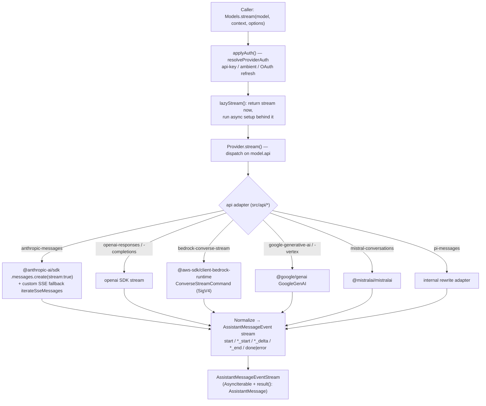

# Package Analysis: `packages/ai` — Unified Multi-Provider LLM API

> Source: `packages/ai/src` — ~23,600 lines across ~158 `.ts` files.
> npm package name: `@earendil-works/pi-ai`.
> Target: exact 1:1 Rust port.

---

## 1. Purpose & Responsibilities

`packages/ai` is the **unified, provider-agnostic LLM inference layer** of the Pi Agent Harness. It gives the rest of the harness a single normalized way to:

- Describe a **model** (id, provider, api, cost, context window, capabilities) — `types.ts:706` `Model<TApi>`.
- Describe a **request** (`Context` = system prompt + messages + tools) — `types.ts:450`.
- **Stream** an assistant turn as a uniform event protocol regardless of the upstream wire format — `types.ts:464` `AssistantMessageEvent`.
- Resolve **auth** (API keys, ambient env/files, OAuth with token refresh) per provider — `auth/`.
- Enumerate a large **generated catalog** of built-in models across ~35 providers — `models.generated.ts`, `providers/*.models.ts`.
- Generate **images** through a parallel but simpler pipeline — `images-models.ts`.

Core design principle (stated repeatedly in comments): the **API implementation modules** (`src/api/*.ts`) are the wire adapters (one per protocol), while **providers** (`src/providers/*.ts`) are thin runtime bindings of `{id, baseUrl, auth, models, api}`. A model carries an `api` field naming which wire protocol streams it; a provider dispatches on that. This cleanly separates "what protocol" (api) from "who hosts it" (provider), so e.g. many providers reuse the `openai-completions` api adapter.

The package is deliberately **layered for tree-shaking / lazy loading**: `index.ts` is side-effect-free core types + utils only; provider factories live under `providers/*`, API implementations under `api/*` (loaded via `*.lazy.ts` dynamic imports), and the old global function API is quarantined in `compat.ts`.

---

## 2. Public API Surface

### Entry points (subpath exports)
- `@earendil-works/pi-ai` → `index.ts`: core types, `models.ts`, `models-store.ts`, `images-models.ts`, auth types/context/store/helpers, faux provider, utils (`event-stream`, `json-parse`, `overflow`, `retry`, `validation`, `typebox-helpers`, `diagnostics`), and re-exports `typebox`'s `Type`/`Static`/`TSchema`.
- `@earendil-works/pi-ai/providers/*` → provider factories.
- `@earendil-works/pi-ai/api/*` → API implementations + `*.lazy.ts` wrappers.
- `@earendil-works/pi-ai/compat` → deprecated global function API (`stream()`, `complete()`, `getModel()`, api-registry). To be deleted after the coding-agent migration (`compat.ts:1-11`).

### Main runtime types & functions
- `createModels(options?) : MutableModels` — `models.ts:529`. The central runtime collection.
- `Models` interface — `models.ts:127`. Methods: `getProviders`, `getProvider`, `getModels(provider?)`, `getModel(provider,id)`, `refresh(opts)`, `checkAuth(id)`, `getAvailable(id?)`, `getAuth(id|model, overrides?)`, `login(id,type,interaction)`, `logout(id)`, `stream(model,ctx,opts)`, `complete(...) : Promise<AssistantMessage>`, `streamSimple`, `completeSimple`.
- `Provider<TApi>` interface — `models.ts:75`. `{id, name, baseUrl?, headers?, auth, getModels(), refreshModels?(), filterModels?(), stream(), streamSimple()}`.
- `createProvider<TApi>(input) : Provider<TApi>` — `models.ts:556`. Builds a provider from parts; `api` may be a single `ProviderStreams` or a `Record<TApi, ProviderStreams>` map dispatched on `model.api`.
- `builtinModels(options?)`, `builtinProviders()`, `getBuiltinModel/Models/Providers` — `providers/all.ts`.
- Helpers: `hasApi(model, api)` type guard (`models.ts:635`), `calculateCost(model, usage)` (`models.ts:639`), `getSupportedThinkingLevels` / `clampThinkingLevel` (`models.ts:663`,`674`), `modelsAreEqual` (`models.ts:699`).
- Images side: `createImagesModels`, `createImagesProvider`, `ImagesModels`, `ImagesProvider` — `images-models.ts`.
- Streaming type: `AssistantMessageEventStream` (async iterable + `.result(): Promise<AssistantMessage>`) — `utils/event-stream.ts:69`.
- Tool validation: `validateToolCall` / `validateToolArguments` (TypeBox + JSON-schema coercion) — `utils/validation.ts:263`.

### The lazy dispatch contract
Every `src/api/*.ts` module exports exactly `stream` and `streamSimple` (image modules export `generateImages`), so the module *itself* satisfies the `ProviderStreams` interface (`types.ts:227`). `lazyApi(load)` (`api/lazy.ts:68`) wraps a dynamic `import()` of such a module. `lazyStream(model, setup)` (`api/lazy.ts:46`) returns a stream synchronously while running async setup behind it, converting setup failures into an `error` event — this is the key concurrency primitive.

---

## 3. Provider Abstraction

### Two-level model
```
Model.api    → which WIRE PROTOCOL (KnownApi, e.g. "anthropic-messages")   → src/api/*.ts adapter
Model.provider → which HOST (KnownProvider, e.g. "anthropic", "fireworks") → src/providers/*.ts factory
```

`KnownApi` (`types.ts:16`): `openai-completions`, `mistral-conversations`, `openai-responses`, `azure-openai-responses`, `openai-codex-responses`, `anthropic-messages`, `bedrock-converse-stream`, `google-generative-ai`, `google-vertex`, `pi-messages`. (`Api = KnownApi | (string & {})` allows custom apis.)

**The common interface every API adapter implements** is `ProviderStreams` (`types.ts:227`):
```ts
stream(model, context, options?)      : AssistantMessageEventStream
streamSimple(model, context, options?): AssistantMessageEventStream
```
`stream` takes fully-shaped provider-specific options; `streamSimple` (`SimpleStreamOptions`, `types.ts:295`) adds a unified `reasoning: ThinkingLevel` + `thinkingBudgets`, then internally maps to the provider's native reasoning encoding via `simple-options.ts` (`buildBaseOptions`, `adjustMaxTokensForThinking`, `clampReasoning`).

**Every provider factory** (`src/providers/*.ts`) is a ~15-line call to `createProvider({id, name, baseUrl, auth, models, api})`. Example (`providers/anthropic.ts`):
```ts
createProvider({
  id: "anthropic", baseUrl: "https://api.anthropic.com",
  auth: { apiKey: envApiKeyAuth("Anthropic API key", ["ANTHROPIC_OAUTH_TOKEN","ANTHROPIC_API_KEY"]),
          oauth: lazyOAuth({ name: "Anthropic (Claude Pro/Max)", load: loadAnthropicOAuth }) },
  models: Object.values(ANTHROPIC_MODELS),
  api: anthropicMessagesApi(),      // lazy ProviderStreams
});
```

**Request → normalized-response flow.** `Models.stream()` (`models.ts:489`) resolves auth (`applyAuth`, `models.ts:463`), overlays `baseUrl`/headers/env, then delegates to `provider.stream()`, which dispatches on `model.api` to the owning adapter. The adapter converts `Context` → provider payload, opens the HTTP/SSE stream, and re-emits provider events as the normalized `AssistantMessageEvent` protocol.



### Every provider present (35 chat + 1 image)
`providers/all.ts:78` `builtinProviders()` constructs:
`amazon-bedrock`, `ant-ling`, `anthropic`, `azure-openai-responses`, `cerebras`, `cloudflare-ai-gateway`, `cloudflare-workers-ai`, `deepseek`, `fireworks`, `github-copilot`, `google`, `google-vertex`, `groq`, `huggingface`, `kimi-coding`, `minimax`, `minimax-cn`, `mistral`, `moonshotai`, `moonshotai-cn`, `nvidia`, `openai`, `openai-codex`, `opencode`, `opencode-go`, `openrouter`, `radius`, `together`, `vercel-ai-gateway`, `xai`, `xiaomi`, `xiaomi-token-plan-ams`, `xiaomi-token-plan-cn`, `xiaomi-token-plan-sgp`, `zai`, `zai-coding-cn`.
Images: `openrouter` (via `openrouter-images` api). Faux/test double: `providers/faux.ts` (`createFauxCore`, scripted deterministic streams for testing).

Most providers are OpenAI-compatible and reuse the `openai-completions` adapter, distinguished only by `baseUrl` + a `compat` object (`OpenAICompletionsCompat`, `types.ts:482`) with ~25 per-provider quirk flags (thinking format, max-tokens field, session-affinity, cache-control convention, etc.). This is the mechanism that lets one adapter serve dozens of hosts.

---

## 4. Key Data Types (the heart of the Rust type model)

All in `types.ts`.

### Content blocks
- `TextContent` `{type:"text", text, textSignature?}` — `types.ts:327`.
- `ThinkingContent` `{type:"thinking", thinking, thinkingSignature?, redacted?}` — `types.ts:333`.
- `ImageContent` `{type:"image", data /*base64*/, mimeType}` — `types.ts:343`.
- `ToolCall` `{type:"toolCall", id, name, arguments:Record<string,any>, thoughtSignature?}` — `types.ts:349`.

### Messages (`Message = UserMessage | AssistantMessage | ToolResultMessage`, `types.ts:419`)
- `UserMessage` `{role:"user", content: string | (Text|Image)[], timestamp}` — `types.ts:382`.
- `AssistantMessage` `{role:"assistant", content:(Text|Thinking|ToolCall)[], api, provider, model, responseModel?, responseId?, diagnostics?, usage, stopReason, errorMessage?, timestamp}` — `types.ts:388`. **This is the canonical output object** — the `.result()` of every stream.
- `ToolResultMessage<TDetails>` `{role:"toolResult", toolCallId, toolName, content:(Text|Image)[], details?, addedToolNames?, isError, timestamp}` — `types.ts:403`.

### Supporting types
- `Context` `{systemPrompt?, messages:Message[], tools?:Tool[]}` — `types.ts:450`.
- `Tool<TParameters extends TSchema>` `{name, description, parameters}` — TypeBox schema — `types.ts:444`.
- `Usage` `{input, output, cacheRead, cacheWrite, cacheWrite1h?, reasoning?, totalTokens, cost:{input,output,cacheRead,cacheWrite,total}}` — `types.ts:357`.
- `StopReason = "stop"|"length"|"toolUse"|"error"|"aborted"` — `types.ts:380`.
- `Model<TApi>` `{id, name, api, provider, baseUrl, reasoning, thinkingLevelMap?, input:("text"|"image")[], cost:ModelCost, contextWindow, maxTokens, headers?, compat?}` — `types.ts:706`. `compat` is conditionally typed on `TApi`.
- `ModelCost`/`ModelCostTier`/`ModelCostRates` — tiered per-million-token pricing — `types.ts:688`.
- `ThinkingLevel = "minimal"|"low"|"medium"|"high"|"xhigh"|"max"`; `ModelThinkingLevel = "off" | ThinkingLevel` — `types.ts:77`.
- `StreamOptions` (`types.ts:113`, ~20 fields incl. `signal`, `apiKey`, `transport`, `cacheRetention`, `sessionId`, `onPayload`/`onResponse` callbacks, `headers`, `timeoutMs`, `maxRetries`, `metadata`, `env`).
- Compat structs: `OpenAICompletionsCompat` (`types.ts:482`), `OpenAIResponsesCompat` (`types.ts:536`), `AnthropicMessagesCompat` (`types.ts:548`), `OpenRouterRouting` (`types.ts:607`), `VercelGatewayRouting` (`types.ts:681`).
- Images: `ImagesContext`, `AssistantImages`, `ImagesModel<TApi>` — `types.ts:424-438,733`.

---

## 5. Streaming Model

Streaming is represented as a **discriminated-union event protocol**, `AssistantMessageEvent` (`types.ts:464`):

```
start
text_start / text_delta / text_end
thinking_start / thinking_delta / thinking_end
toolcall_start / toolcall_delta / toolcall_end
done  (reason: stop|length|toolUse, message)
error (reason: aborted|error, error)
```

Every event except the terminal ones carries `contentIndex` (index into `AssistantMessage.content`) and a `partial: AssistantMessage` snapshot, so a consumer can render incrementally *or* just await the terminal message. Contract (`types.ts:301-313`): once `stream()` is invoked, all failures are encoded as an `error` event carrying an `AssistantMessage` with `stopReason:"error"|"aborted"` — the function does **not** throw.

**Transport:** `AssistantMessageEventStream` (`utils/event-stream.ts:69`) extends a generic push/pull `EventStream<T,R>` — a hand-rolled async queue with a `waiting` promise list and a `finalResultPromise` resolved when a `done`/`error` event arrives. `.result()` returns that promise. This is a classic producer/consumer channel.

**Token streaming:** adapters accumulate deltas into the current content block's `text`/`thinking` field and emit `*_delta` with the raw slice.

**Tool-call streaming:** tool arguments arrive as JSON fragments. `toolcall_delta.delta` carries the raw JSON string chunk; the accumulated buffer is parsed with `parseStreamingJson` (`utils/json-parse.ts:104`) which tolerates incomplete JSON via `partial-json` plus a bespoke `repairJson` (escapes raw control chars, fixes bad escapes). At `content_block_stop` the final args are parsed and emitted in `toolcall_end.toolCall`. Anthropic negotiates `eager_input_streaming` / fine-grained tool streaming beta headers (`AnthropicMessagesCompat.supportsEagerToolInputStreaming`).

**SSE parsing:** for the Anthropic path there is a hand-written UTF-8 SSE decoder — `iterateSseMessages(body: ReadableStream<Uint8Array>, signal)` (`api/anthropic-messages.ts:384`): `getReader()` + `TextDecoder({stream:true})`, line buffering via `consumeLine`, event assembly via `decodeSseLine`/`flushSseEvent` over an `SseDecoderState {event, data[], raw[]}`, with abort checks each read. It validates event names against `ANTHROPIC_MESSAGE_EVENTS` and enforces "must end with `message_stop`". Other adapters lean on their official SDK's built-in async-iterable streaming (e.g. `client.messages.create({stream:true})`, `openai` SDK stream, Bedrock `ConverseStreamCommand`).

**Reasoning/thinking budgets:** `simple-options.ts:51` `adjustMaxTokensForThinking` maps thinking levels to token budgets (minimal 1024 → high 16384) for token-based providers; effort-based providers use `thinkingLevelMap`.

---

## 6. Auth / OAuth

Auth is fully abstracted in `src/auth/`. Key interfaces (`auth/types.ts`):

- `Credential = ApiKeyCredential | OAuthCredential` (type-tagged) — `auth/types.ts:37`.
- `CredentialStore` (`auth/types.ts:60`): `read`, `list`, `modify(id, fn)` (the *only* write path — a serialized per-provider read-modify-write, cross-process lockable), `delete`. `modify` is where OAuth refresh runs so concurrent requests can't double-refresh.
- `ProviderAuth {apiKey?: ApiKeyAuth, oauth?: OAuthAuth}` (`auth/types.ts:217`) — at least one required.
- `ApiKeyAuth` (`auth/types.ts:161`): `{name, login?, check?, resolve()}`. `resolve()` merges stored key → ambient env vars → files.
- `OAuthAuth` (`auth/types.ts:189`): `{name, loginLabel?, login(), refresh(cred,signal), toAuth(cred)}`. The `refresh`/`toAuth` split lets `Models` own the locked refresh.
- `AuthContext` (`auth/types.ts:91`): injectable `env(name)` + `fileExists(path)` (browser-safe, mockable).
- `AuthInteraction` / `AuthPrompt` / `AuthEvent` (`auth/types.ts:119-155`): login UX callbacks — `prompt({type: text|secret|select|manual_code})` and `notify({type: info|auth_url|device_code|progress})`.

**Resolution** — `resolveProviderAuth` (`auth/resolve.ts:37`): request `apiKey` override wins; else a stored credential owns the provider (OAuth → `resolveStoredOAuth`, api-key → merge); else ambient env/files. `resolveStoredOAuth` (`auth/resolve.ts:84`) is **double-checked locking**: valid token → 0 locks; expired → `credentials.modify()`, re-check expiry under lock, `oauth.refresh()` once, persist rotated credential. `ModelsError` codes: `oauth`, `auth`, `provider`, `stream`, `model_source`, `model_validation`.

**Helpers** (`auth/helpers.ts`): `envApiKeyAuth(name, envVars[])` (stored key wins, else first set env var); `lazyOAuth({name, load})` — advertises OAuth without importing Node-only flow code, loading on first `login`/`refresh`/`toAuth`.

**OAuth flows** (`auth/oauth/`): `anthropic.ts` (PKCE + `node:http` loopback callback server on port 53692, `claude.ai/oauth/authorize` → `platform.claude.com/v1/oauth/token`, hardcoded CLIENT_ID), `github-copilot.ts`, `openai-codex.ts`, `xai.ts`, `radius.ts`, shared `pkce.ts` (PKCE challenge), `device-code.ts` (device-code grant), `oauth-page.ts` (success/error HTML), `load.ts` (dynamic-import registry). These are **CLI/Node-only** (they spin up local HTTP servers and use `atob`, `node:http`).

---

## 7. External Dependencies → Rust crate map

| npm dependency | Used for | Proposed Rust crate |
|---|---|---|
| `@anthropic-ai/sdk` 0.91.1 | Anthropic Messages types + streaming client | `reqwest` + hand-rolled types (or `anthropic-sdk` if adequate; likely hand-roll for 1:1) |
| `openai` 6.26.0 | OpenAI Completions + Responses clients | `reqwest` + `async-openai` (or hand-roll Responses API — `async-openai` lacks Responses) |
| `@aws-sdk/client-bedrock-runtime` 3.x + `@smithy/node-http-handler` | Bedrock ConverseStream, SigV4 signing | `aws-sdk-bedrockruntime` + `aws-config` (official AWS Rust SDK) |
| `@google/genai` 1.52.0 | Google Generative AI + Vertex | hand-roll over `reqwest` (no mature Rust GenAI SDK) or `google-generative-ai-rs` |
| `@mistralai/mistralai` 2.2.6 | Mistral conversations | hand-roll over `reqwest` |
| `typebox` 1.1.38 | Tool parameter JSON-schema + runtime validation/coercion | `serde_json::Value` + `jsonschema` crate; `schemars` for schema derivation |
| `partial-json` 0.7 | Incremental parse of streaming tool-call JSON | `serde_json` StreamDeserializer won't suffice → custom partial parser or `jsonparser`/`struson`; likely a hand-port of `repairJson` + a lenient parser |
| `http-proxy-agent` / `https-proxy-agent` | HTTP(S) proxy support | `reqwest` built-in proxy (`reqwest::Proxy`) |
| `@opentelemetry/api` | tracing hooks | `tracing` + `opentelemetry` crate |
| (WHATWG `fetch`/`ReadableStream`/`TextDecoder`) | HTTP + SSE | `reqwest` (streaming `bytes_stream()`), `tokio`, `eventsource-stream` or hand-rolled SSE decoder |
| (async iterables / promises) | streaming channel | `tokio` + `futures::Stream` / `tokio::sync::mpsc` |
| `node:http` (OAuth callback) | loopback OAuth server | `tiny_http` / `axum` / `hyper` |
| `atob`/`btoa`, base64 images | encoding | `base64` crate |

Runtime baseline: `tokio` + `reqwest` (rustls) + `serde`/`serde_json` + `futures`.

---

## 8. Rust Porting Notes (the hard parts)

### 8.1 Provider trait design
The TS `ProviderStreams` maps naturally to:
```rust
#[async_trait]
pub trait ProviderStreams: Send + Sync {
    fn stream(&self, model: &Model, ctx: &Context, opts: Option<StreamOptions>) -> AssistantMessageEventStream;
    fn stream_simple(&self, model: &Model, ctx: &Context, opts: Option<SimpleStreamOptions>) -> AssistantMessageEventStream;
}
```
`stream` returns synchronously while doing async work behind it — port `lazyStream` as a function returning a stream handle backed by a `tokio::sync::mpsc` channel with a spawned task; setup errors become an `error` event (mirror `api/lazy.ts`). The generic `TApi` phantom typing in TS (`Model<TApi>`, conditional `compat`) has no clean Rust equivalent — **collapse to a runtime `Api` enum** plus a `Compat` enum (one variant per compat struct). `hasApi()` becomes matching on the enum. Losing compile-time api↔options coupling is acceptable and idiomatic.

### 8.2 Enum modeling of streaming events
`AssistantMessageEvent` → a `#[derive(Serialize, Deserialize)] #[serde(tag="type")]` enum with `snake_case` rename. `contentIndex` → `content_index: usize`. The `partial: AssistantMessage` on nearly every variant means events carry a full clone — in Rust prefer `Arc<AssistantMessage>` snapshots or an `Arc<Mutex<AssistantMessage>>` builder shared with the consumer to avoid deep clones per delta. Content blocks (`Text|Thinking|Image|ToolCall`) → an internally-tagged enum; note `Message` uses `role` as the discriminant (`user|assistant|toolResult`) while content uses `type`.

### 8.3 The `EventStream` channel
`utils/event-stream.ts` is a bespoke push/pull async queue with a "final result" promise. Port as a struct wrapping `mpsc::UnboundedSender<Event>` for `push`, a `mpsc::UnboundedReceiver` behind `impl Stream`, and a `tokio::sync::oneshot` (or `watch`) for `.result()`. The "isComplete/extractResult" closures become: on `Done`/`Error`, resolve the oneshot with the contained `AssistantMessage`.

### 8.4 Generated model catalogs — **the biggest structural item**
`scripts/generate-models.ts` (**80 KB**) is a build-time Node script that fetches model metadata (models.dev registry + per-provider registries) and emits, per provider: a `providers/data/<provider>.json` data file and a typed `providers/<provider>.models.ts` wrapper (`import values from "./data/x.json"; export const X_MODELS = values as {...}`), then an aggregate `models.generated.ts` (`MODELS = {provider: X_MODELS, ...} as const`). The `data/*.json` files are **git-ignored / build-generated** (they were absent in the checkout; `build` regenerates them and copies `src/providers/data` → `dist`).

**Rust can and should reproduce this exactly**, and more robustly:
- Keep the generator as a standalone step. Options: (a) a `build.rs` that reads checked-in JSON catalogs and generates Rust `static`/`phf` maps, or (b) ship the JSON as runtime assets loaded via `serde_json` at startup, or (c) `include_str!` + `once_cell::Lazy` parse. Given ~35 providers and large catalogs (openrouter.models is 32 KB, vercel 24 KB), **runtime load via `serde_json` into a `HashMap<ProviderId, HashMap<ModelId, Model>>`** is simplest and avoids compile-time bloat; use `phf` only if startup cost matters.
- The TS `as const` literal-typing of ids/providers is a compile-time nicety with no Rust equivalent — drop it; validate at load time instead.
- Port `generate-models.ts` as a separate Rust bin (or keep the TS generator and consume its JSON output) — it is network/registry logic, not core runtime, so a 1:1 behavioral port of the fetch/merge/dedup/pricing-tier logic is what matters, not its type emission.

### 8.5 SSE parsing
Two strategies coexist and both must be ported: (1) SDK-driven async iteration (Anthropic/OpenAI/Bedrock/Google/Mistral SDKs) and (2) the hand-rolled `iterateSseMessages` for the raw-fetch Anthropic path. For Rust, standardize on **one** SSE decoder over `reqwest::Response::bytes_stream()` — either `eventsource-stream` or a hand-port of `consumeLine`/`decodeSseLine`/`flushSseEvent` with an `SseDecoderState`. The hand-rolled version handles multi-line `data:`, `event:`, raw-line retention for error messages, `\r\n`/`\n`, UTF-8 boundary buffering (`TextDecoder({stream:true})` → incremental `str::from_utf8` with a carry buffer), and abort-signal checks (→ `tokio::select!` on a `CancellationToken`).

### 8.6 Streaming JSON repair
`json-parse.ts` (`repairJson` + `partial-json` fallback chain) has no drop-in Rust crate. Port `repairJson` verbatim (it's a small char-scanner) and pair it with a lenient/partial JSON parser for the incomplete-args case. Behavior must match exactly because tool-call arg accumulation depends on it.

### 8.7 Per-provider quirks that resist a clean trait
- **Compat matrices**: `OpenAICompletionsCompat` alone has ~25 boolean/enum flags (thinking format across 9 variants: openai/openrouter/deepseek/together/zai/qwen/chat-template/qwen-chat-template/string-thinking/ant-ling; max-tokens field; session-affinity formats; anthropic-style cache-control; `chatTemplateKwargs` with `$var` substitution). These are pure data → model each as a Rust struct with `Option<enum>` fields; the branching stays in the `openai-completions` adapter. Auto-detection-from-baseUrl fallbacks must be ported (functions that inspect the URL when `compat` is unset).
- **Bedrock**: SigV4 signing + custom header injection via Smithy build-step middleware; reserved headers (`x-amz-*`, `authorization`, `host`) silently dropped (`types.ts:145-151`). Use the official AWS Rust SDK's middleware/interceptors.
- **Anthropic "stealth mode"**: mimics Claude Code tool naming/casing and sends a fixed `claudeCodeVersion` (`anthropic-messages.ts:73-110`); tool names are canonicalized case-insensitively. Must be ported faithfully.
- **Google**: `thoughtSignature` opaque round-tripping on tool calls (`types.ts:354`); thinking config differs.
- **OpenAI Codex Responses**: supports a **WebSocket** transport (`Transport = "sse"|"websocket"|"websocket-cached"|"auto"`, `types.ts:101`; `openai-codex-responses.ts` references WebSocket + debug stats) — Rust needs `tokio-tungstenite` in addition to SSE.
- **Redacted thinking / signatures**: `ThinkingContent.redacted` + opaque `thinkingSignature` must survive multi-turn replay; several `compat` flags (`allowEmptySignature`, `requiresThinkingAsText`) govern how thinking blocks are serialized back.
- **Deferred tools**: `ToolResultMessage.addedToolNames` + `deferredToolsMode:"kimi"` + `supportsToolReferences` — a niche cross-provider feature (`utils/deferred-tools.ts`).
- **Retry classification**: `utils/retry.ts` is a large regex of retryable vs non-retryable provider error strings — port the regex set verbatim.
- **Cost calc**: `calculateCost` (`models.ts:639`) includes Anthropic 1h-cache 2x-input pricing and tiered thresholds — port exactly.

### 8.9 Proposed Rust module / crate layout
```
pi-ai/                         (crate)
  src/
    lib.rs                     (index.ts re-exports)
    types.rs                   (Model, Message, content enums, AssistantMessageEvent, options, compat structs)
    models.rs                  (Provider trait, Models collection, create_provider, cost/thinking helpers)
    models_store.rs
    models_generated.rs        (or build.rs + generated/); loads providers/data/*.json
    images_models.rs
    event_stream.rs            (utils/event-stream: mpsc + oneshot channel)
    api/                       (one module per KnownApi adapter; each impl ProviderStreams)
      mod.rs  lazy.rs  simple_options.rs  transform_messages.rs
      anthropic_messages.rs  openai_completions.rs  openai_responses.rs
      openai_codex_responses.rs  azure_openai_responses.rs
      bedrock_converse_stream.rs  google_generative_ai.rs  google_vertex.rs
      mistral_conversations.rs  pi_messages.rs  openrouter_images.rs
    providers/                 (thin factories + *.models loaders + data/*.json)
    auth/                      (types, resolve, helpers, credential_store, context; oauth/ submodule)
    utils/                     (sse.rs, json_parse.rs, retry.rs, overflow.rs, validation.rs, estimate.rs, ...)
  build.rs                     (optional: embed/validate model catalogs)
```
Recommend a single crate with feature flags per provider family (to gate heavy deps like the AWS SDK) rather than a workspace, preserving the tree-shaking intent of the TS layering. Keep the OAuth/CLI-only flows behind a `cli`/`native` feature (they need a local HTTP server).

---

## Appendix — files read for this analysis
Core: `index.ts`, `types.ts`, `models.ts`, `models.generated.ts`, `models-store.ts`, `images-models.ts`, `compat.ts`.
Providers: `providers/all.ts`, `providers/anthropic.ts`, `providers/openai.ts`, `providers/anthropic.models.ts`, `providers/faux.ts` (partial).
API: `api/lazy.ts`, `api/simple-options.ts`, `api/anthropic-messages.ts` (SSE + stream loop), and import-level inspection of `openai-completions.ts`, `openai-responses.ts`, `bedrock-converse-stream.ts`, `google-generative-ai.ts`, `mistral-conversations.ts`.
Auth: `auth/types.ts`, `auth/resolve.ts`, `auth/helpers.ts`, `auth/oauth/anthropic.ts`.
Utils: `event-stream.ts`, `json-parse.ts`, `validation.ts`, `retry.ts`.
Build: `scripts/generate-models.ts` (header), `package.json`.
