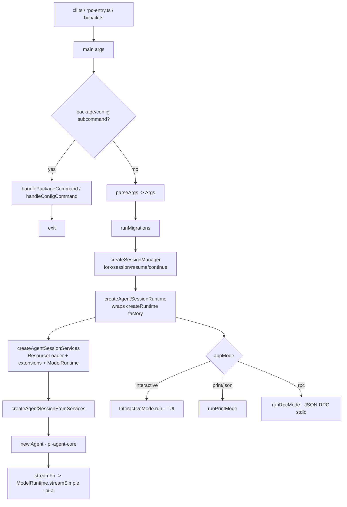

# Package Analysis: `packages/coding-agent`

> The interactive coding-agent CLI — the product. ~54,700 LOC across ~175 `.ts` files under `src/`.
> Analysis target for an EXACT 1:1 Rust port. Source root:
> `packages/coding-agent/src`.

---

## 1. Purpose & Responsibilities

`coding-agent` is the shippable binary (`pi`). It is a thin-but-large orchestration
layer that turns CLI arguments + config + resources into a running `AgentSession`
backed by the sibling `@earendil-works/pi-agent-core` (agent loop) and
`@earendil-works/pi-ai` (provider/model layer) packages. Concretely it owns:

- **Process bootstrap & arg parsing** (`cli.ts`, `main.ts`, `cli/args.ts`).
- **Config, auth, models, sessions** persistence under `~/.pi/agent/` (`config.ts`, `core/settings-manager.ts`, `core/session-manager.ts`, `core/auth-storage.ts`, `core/models-store.ts`).
- **The built-in tool suite** the LLM can call: `read, bash, edit, write, grep, find, ls` (`core/tools/`).
- **An extension system** that dynamically loads TypeScript/JS plugins via `jiti`, exposing a large event/tool/command/provider API (`core/extensions/`).
- **Resources**: skills, prompt-templates, themes, context files, keybindings, slash-commands (`core/resource-loader.ts`, `core/skills.ts`, `core/prompt-templates.ts`, `core/slash-commands.ts`, `core/keybindings.ts`).
- **Three run modes**: interactive TUI, print (one-shot/pipe), and RPC (JSON-RPC over stdio) (`modes/`).
- **Cross-cutting concerns**: context compaction, telemetry, HTML export, project trust, self-update / package management, HTTP dispatcher tuning, model resolution.

The design intent (see `main.ts:1-6`) is that the SDK does the heavy lifting; this
package translates CLI flags into `createAgentSession()` options and renders the
result. In practice the interactive TUI and extension system dominate the LOC.

---

## 2. Directory Map

| Path | Responsibility | ~LOC | Port priority |
|---|---|---|---|
| `cli.ts` | Node shebang entry; sets `process.title`, HTTP dispatcher, calls `main()` | 21 | core |
| `rpc-entry.ts` | RPC entry: injects `--mode rpc`, calls `main()` | 12 | high |
| `main.ts` | The real bootstrap: arg dispatch, migrations, session manager, runtime factory, mode dispatch | 860 | **core** |
| `config.ts` | Package/app detection, install-method & self-update logic, all config paths (`~/.pi/agent/*`) | 567 | **core** |
| `migrations.ts` | One-time startup migrations (auth.json, sessions, tools→bin, keybindings, commands→prompts) | 316 | high |
| `index.ts` | Public SDK surface re-exports | ~330 | medium |
| `package-manager-cli.ts` | `install/remove/update/list/config` subcommands (npm/git package sources) | 887 | medium |
| `cli/` | arg parsing (`args.ts`), file/@-arg processing, session picker, startup UI, list-models, project-trust prompts | 1,043 (8 files) | high |
| `core/` (root) | Session runtime, SDK factory, model registry/runtime/resolver, settings, sessions, system-prompt, event-bus, exec, bash-executor, telemetry, trust, HTTP dispatcher | 17,227 (44 files) | **core** |
| `core/tools/` | The 7 built-in tools + truncation, path-utils, mutation queue, render helpers | 4,072 (15 files) | **core** |
| `core/extensions/` | `types.ts` (plugin API), `loader.ts` (jiti dynamic import), `runner.ts` (event dispatch/lifecycle), `wrapper.ts` | 3,846 (5 files) | **core (hardest)** |
| `core/compaction/` | Context compaction + branch summarization | 1,420 (4 files) | high |
| `core/export-html/` | Session → HTML export (ANSI→HTML, tool renderers) | 746 (3 files) | low |
| `extensions/` (top-level) | Built-in inline extensions; only `llama.cpp` provider (`extensions/llama/`) | 1,382 | medium |
| `modes/` | mode barrel + `print-mode.ts` (159) | 174 | high |
| `modes/interactive/` | The TUI: `interactive-mode.ts` (6,008), model-search, theme controller | 6,029 | high |
| `modes/interactive/components/` | 40 TUI components (selectors, editors, message/tool renderers, diff, footer) | 9,214 | high |
| `modes/interactive/theme/` | Theme + syntax highlight controller | 1,420 | medium |
| `modes/rpc/` | JSON-RPC mode: `rpc-mode.ts` (795), client, jsonl, types | 1,726 | high |
| `utils/` | fs-watch, git, image processing (photon/sharp-free), clipboard, shell, paths, ansi, syntax-highlight, mime, frontmatter, version-check, windows-self-update | 3,255 (30 files) | medium |
| `bun/` | Bun-binary specific bootstrap (bedrock register, sandbox env restore, OAuth flows) | 55 | low |

---

## 3. CLI Entry & Bootstrap

**Entry points.** Three shebang files converge on `main(args)`:
- `cli.ts:20` — the primary Node entry (`main(process.argv.slice(2))`).
- `rpc-entry.ts:12` — forces `--mode rpc`.
- `bun/cli.ts` — Bun compiled-binary entry; registers Bun OAuth + Bedrock, restores sandbox env, then `import("../cli.ts")`.

**`main()` flow** (`main.ts:473-859`):
1. Merge built-in + injected inline extensions (`main.ts:475`); handle `--offline` env flags.
2. Windows self-update quarantine cleanup (`main.ts:482`).
3. Bootstrap `SettingsManager`, apply HTTP proxy, configure undici dispatcher (`main.ts:488-490`).
4. **Package/config subcommand short-circuits**: `handlePackageCommand` / `handleConfigCommand` (`main.ts:492-507`) — these are the `install/update/list/config` verbs, handled before arg parsing.
5. `parseArgs(args)` → `Args` (`main.ts:509`; parser at `cli/args.ts:63-210`). Hand-rolled flag loop, no library. `@`-prefixed = file args; unknown `--flags` collected into `unknownFlags` map for extensions.
6. Early exits: `--version`, `--export` (`main.ts:521-538`).
7. `resolveAppMode()` (`main.ts:100-111`) → `rpc | json | print | interactive`, derived from flags + TTY status. `takeOverStdout()` for non-interactive.
8. `runMigrations(cwd)` (`main.ts:555`).
9. **Session resolution** (`createSessionManager`, `main.ts:264-355`): handles `--fork/--session/--resume/--continue/--session-id/--no-session`, session-dir precedence (`--session-dir` > env `PI_CODING_AGENT_SESSION_DIR` > settings). Missing-cwd prompt handling.
10. **Runtime factory** `createRuntime` (`main.ts:615-739`): resolves project trust (`ProjectTrustStore`), builds a per-cwd `SettingsManager`, calls `createAgentSessionServices` (loads resources + extensions + model runtime), resolves scoped models, builds `CreateAgentSessionOptions` via `buildSessionOptions` (`main.ts:357-453`), then `createAgentSessionFromServices`.
11. `createAgentSessionRuntime(createRuntime, …)` (`main.ts:741`) wraps it so the runtime can be **rebuilt on `/reload` and session switches**.
12. Read piped stdin (non-rpc), build initial message + images, init theme, report diagnostics.
13. **Mode dispatch** (`main.ts:811-858`): `runRpcMode(runtime)` | `new InteractiveMode(runtime,…).run()` | `runPrintMode(runtime,…)`.

**Connection to sibling packages.** `core/sdk.ts:289` constructs `new Agent({...})` from `@earendil-works/pi-agent-core`, wiring: `streamFn` → `modelRuntime.streamSimple` (pi-ai), `convertToLlm` (with image-block defense), `transformContext`/`onPayload`/`onResponse`/`transformHeaders` → extension runner hooks. Tools are TypeBox-schema'd `ToolDefinition`s wrapped into agent-core `AgentTool`s via `wrapToolDefinition`.



---

## 4. The Tool System (critical for the port)

All built-in tools live in `core/tools/` and follow one pattern: a `create<Name>ToolDefinition(cwd, options)` returns a `ToolDefinition` (TypeBox `parameters` + async `execute` + TUI `renderCall`/`renderResult`), and `create<Name>Tool` wraps it into an agent-core `AgentTool` via `wrapToolDefinition` (`core/tools/tool-definition-wrapper.ts`). Registry & grouping helpers are in `core/tools/index.ts:81-196`.

`ToolName = "read" | "bash" | "edit" | "write" | "grep" | "find" | "ls"` (`index.ts:83-84`). **Default active set** = `["read","bash","edit","write"]` (`sdk.ts:240`); `grep/find/ls` exist but are **off by default** (read-only mode enables them). `createReadOnlyTools` = `read,grep,find,ls`.

| Tool | File | Input schema (TypeBox) | Output / details | Notes for port |
|---|---|---|---|---|
| **read** | `read.ts:20-24` | `{ path: string, offset?: number, limit?: number }` | text or image content; `details.truncation`. Truncates to `DEFAULT_MAX_LINES`/`DEFAULT_MAX_BYTES` (`truncate.ts`); image auto-resize to 2000² | Image handling via `utils/image-process` (photon). Special "compact" rendering for AGENTS.md/CLAUDE.md/SKILL.md/pi docs (`read.ts:98-162`). Offset/limit continuation notices. |
| **bash** | `bash.ts:40-43` | `{ command: string, timeout?: number }` (seconds) | stdout+stderr merged, last-N truncation, `details.{truncation,fullOutputPath}` | Streams via `spawn`, process-tree kill on abort/timeout (`utils/shell.ts` `killProcessTree`, detached pid tracking). Pluggable `BashOperations` (for SSH/remote). Full output spilled to temp file when truncated (`OutputAccumulator`). |
| **edit** | `edit.ts:33-53` | `{ path: string, edits: [{oldText, newText}] }` | success text + `details.{diff,patch,firstChangedLine}` | Exact-match multi-edit; BOM strip, LF-normalize + line-ending restore (`edit-diff.ts`). Serialized through `withFileMutationQueue` (`file-mutation-queue.ts`). Legacy single `oldText/newText` and stringified-`edits` shims in `prepareArguments` (`edit.ts:94-118`). |
| **write** | `write.ts:14-19` | `{ path: string, content: string }` | success text | Creates/overwrites; mutation queue. |
| **grep** | `grep.ts:24-35` | `{ pattern, path?, glob?, ignoreCase?, literal?, context?, limit? }` | matches with file:line | Uses managed `rg` (ripgrep) binary; respects `.gitignore`; long lines trimmed. Off by default. |
| **find** | `find.ts:20-25` | `{ pattern (glob), path?, limit? }` | file paths | Uses managed `fd` binary; respects `.gitignore`. Off by default. |
| **ls** | `ls.ts:14-16` | `{ path?, limit? }` | sorted entries, `/` suffix for dirs, dotfiles included | Off by default. |

**Execution/rendering contract** (`core/extensions/types.ts:439-486`): `execute(toolCallId, params, signal, onUpdate, ctx)` returns `AgentToolResult<TDetails>`. `renderShell` = `"default" | "self"` (edit uses `self`). `executionMode` = `sequential | parallel`. `onUpdate` streams partial results (bash streaming). Custom tools registered by extensions use the identical `ToolDefinition` interface — there is **no separate tool API for extensions vs built-ins**.

`grep`/`find` depend on external `rg`/`fd` binaries managed under `~/.pi/agent/bin/` (see `config.ts:549 getBinDir`, `utils/tools-manager.ts`, migrations move `tools/`→`bin/`).

---

## 5. The Extension System (hardest port problem)

**Three files matter:**

- **`core/extensions/types.ts`** (1,683 LOC) — the entire plugin API surface: `ExtensionAPI` (`types.ts:1167-1402`), `ExtensionContext`/`ExtensionCommandContext`, ~30 event types (`ExtensionEvent` union `types.ts:1020-1045`), `ToolDefinition`, `ProviderConfig`, and the `ExtensionRuntime` state machine.
- **`core/extensions/loader.ts`** (721 LOC) — dynamic module loading via **`jiti`** (`loader.ts:411-428`). Two modes: Bun compiled binary uses `virtualModules` (bundled `@earendil-works/*`, `typebox`) with `tryNative:false`; Node/dev uses `alias` to resolve workspace/`node_modules` paths (`loader.ts:47-138`). Discovery (`discoverAndLoadExtensions` `loader.ts:673-721`): project `.pi/extensions/`, then global `~/.pi/agent/extensions/`, then explicit `--extension` paths; supports single files, `index.ts`, or `package.json` `pi.extensions` manifest.
- **`core/extensions/runner.ts`** (1,214 LOC) — the `ExtensionRunner` executes handlers and mediates all lifecycle: `bindCore()`, `emit()` and typed emitters (`emitToolCall`, `emitToolResult`, `emitContext`, `emitBeforeAgentStart`, `emitBeforeProviderRequest/Headers`, `emitResourcesDiscover`, `emitInput`, `emitUserBash`, `emitMessageEnd`), tool/command/shortcut/flag/provider registries, UI-context injection per mode.

**Plugin API shape.** An extension is `export default (pi: ExtensionAPI) => void | Promise<void>` (`types.ts:1477`). It can: subscribe to events (`pi.on(...)`), `registerTool`, `registerCommand`, `registerShortcut`, `registerFlag`, `registerMessageRenderer/EntryRenderer`, `registerProvider` (custom LLM providers incl. OAuth + `streamSimple`), plus runtime actions (`sendMessage`, `setModel`, `compact`, `newSession`, `fork`, `navigateTree`, `switchSession`, `reload`). Minimal example (`examples/extensions/hello.ts`): defines a TypeBox tool and calls `pi.registerTool`. Rich examples: `plan-mode/`, `custom-provider-anthropic/`, `doom-overlay/`, `gondolin/`, `sandbox/` (each a package with its own `node_modules`). The only **built-in inline extension** is `llama.cpp` (`extensions/index.ts:4`, hidden).

**Runtime lifecycle nuance.** Provider registrations issued during load are **queued** (`pendingProviderRegistrations`) and flushed when the runner `bindCore()`s (`loader.ts:207-219`). Extensions can be invalidated/marked stale across `/reload` and session replacement (`loader.ts:201-205`), and the whole runtime is rebuilt by `createAgentSessionRuntime` (`main.ts:615`).

### Rust porting implications (the #1 risk)

JS extensions are arbitrary TypeScript executed in-process with full access to the
pi API, TUI components, and provider SDKs. There is **no clean 1:1** for `jiti`
dynamic `import()` in Rust. Options, from most-faithful to most-pragmatic:

1. **Embedded JS engine (recommended for fidelity)** — embed Deno core / `rquickjs` / `boa` and keep extensions as JS/TS. Preserves the existing extension ecosystem verbatim, but requires re-exposing the *entire* `ExtensionAPI` (events, TUI components, provider registration) as host bindings — a very large binding surface, and TUI component factories (`Component & { dispose }`) are especially hard to bridge.
2. **WASM component model** — recompile extensions to WASM with a WIT-defined host interface. Clean sandboxing, but forces extension authors off raw TS and cannot express the TUI `Component` factories or live provider `streamSimple` easily. Breaks the "load any `.ts` file" contract.
3. **Native dynamic libraries (`libloading`)** — `.so/.dll` plugins against a stable ABI. Fast, but abandons the JS ecosystem entirely and is unsafe/fragile across compiler versions.
4. **Scoped built-in subset (recommended for MVP)** — port only the built-in/inline extensions (currently just `llama.cpp`) plus a *declarative* config-driven subset (provider registration, tool allow/deny, prompt/skill discovery) as native Rust, and defer arbitrary code loading. This delivers a working product without a scripting engine; full parity via option 1 later.

Recommendation: ship **option 4** first (native providers + declarative resources), architect the runner/event-bus so a scripting host (**option 1**) can be slotted behind the same `ExtensionRunner` trait later. The event/emit model (typed `emit*` methods returning results) maps cleanly to a Rust trait with async methods regardless of the eventual host.

---

## 6. Modes

`modes/index.ts` exports three run modes:

- **Interactive** (`modes/interactive/interactive-mode.ts`, 6,008 LOC + 40 components) — the full terminal UI built on `@earendil-works/pi-tui`: streaming message rendering, tool-execution rows, diff view, selectors (model/session/theme/settings/trust/extension), custom editor, footer, first-time setup, model search. This is the largest single subsystem and the most TUI-coupled.
- **Print** (`modes/print-mode.ts`, 159 LOC) — one-shot / piped execution; emits text or JSON (`--mode json`). Used when stdin/stdout is not a TTY or `-p` given.
- **RPC** (`modes/rpc/`, 1,726 LOC) — JSON-RPC over stdio (`rpc-mode.ts` 795, `rpc-client.ts`, `jsonl.ts`, `rpc-types.ts`). Enables embedding pi as a subprocess (extension UI requests are proxied back over RPC).

Note: "modes" here are *run modes*, not editor modes. There is a *plan-mode* but it is an **extension** (`examples/extensions/plan-mode/`), not part of `modes/`.

---

## 7. Config & Migrations

**Paths** (`config.ts:511-566`): everything under `~/.pi/agent/` (overridable via `PI_CODING_AGENT_DIR`): `models.json`, `auth.json`, `settings.json`, `tools/`, `bin/` (managed fd/rg), `prompts/`, `sessions/`, `themes/`, `<app>-debug.log`. App identity (`name`, `configDir`, version) is read from the package.json `piConfig` block (`config.ts:479-496`) — the binary is rebrandable (`APP_NAME` default `pi`).

**Settings schema** — `Settings` interface (`settings-manager.ts:83-129`), ~45 fields incl. `defaultProvider/Model/ThinkingLevel`, `transport`, `steeringMode`, `followUpMode`, `theme`, `compaction`, `branchSummary`, `retry`, `shellPath`, `shellCommandPrefix`, `npmCommand`, `packages[]`, `extensions[]/skills[]/prompts[]/themes[]`, `enabledModels[]`, `thinkingBudgets`, `httpProxy`, `httpIdleTimeoutMs`, plus nested `TerminalSettings`, `ImageSettings`, `MarkdownSettings`, `WarningSettings`. `SettingsManager` supports **layered global + project merge** (`deepMergeSettings` `settings-manager.ts:132`) gated by project trust, with `migrateSettings` on load and drainable error diagnostics.

**Migrations** (`migrations.ts`, run once at startup via `runMigrations` `migrations.ts:305`):
1. `migrateAuthToAuthJson` — legacy `oauth.json` + `settings.apiKeys` → `auth.json` (mode `0600`).
2. `migrateSessionsFromAgentRoot` — v0.30.0 bug fix, relocate stray `*.jsonl`.
3. `migrateToolsToBin` — move managed `fd/rg` from `tools/`→`bin/`.
4. `migrateKeybindingsConfigFile` — remap keybindings.json.
5. `migrateExtensionSystem` — rename `commands/`→`prompts/`, warn on deprecated `hooks/` and custom `tools/` dirs.

For Rust: these are simple filesystem/JSON transforms; straightforward to port with `serde_json`. The port must preserve the exact `auth.json`/`settings.json`/session-dir encoding (session dir uses `--<cwd-with-slashes-as-dashes>--`, `migrations.ts:112`) for on-disk compatibility.

---

## 8. External Dependencies → Rust Crate Equivalents

| npm dependency | Purpose | Rust equivalent |
|---|---|---|
| `@earendil-works/pi-agent-core` | agent loop (sibling pkg) | ported sibling crate |
| `@earendil-works/pi-ai` | providers/models/streaming (sibling) | ported sibling crate |
| `@earendil-works/pi-tui` | terminal UI toolkit (sibling) | ported sibling crate (or `ratatui`) |
| `typebox` | tool param JSON-Schema | `schemars` + `serde_json` (tool schemas), or hand-built `serde_json::Value` schemas |
| `jiti` | dynamic TS/JS import for extensions | **no direct equivalent** — see §5 (rquickjs/deno_core/WASM) |
| `chalk` | terminal colors | `owo-colors` / `nu-ansi-term` |
| `cross-spawn` | portable process spawn | `std::process` / `tokio::process` |
| `diff` | text diffing (edit tool) | `similar` |
| `glob` / `minimatch` | glob matching (find, discovery) | `globset` / `glob` |
| `ignore` | .gitignore semantics | `ignore` (same authors as ripgrep) |
| `highlight.js` | syntax highlighting | `syntect` |
| `hosted-git-info` | parse git URLs (packages) | `git-url-parse` |
| `proper-lockfile` | session/settings file locking | `fs4` / `fd-lock` |
| `semver` | version compare (updates) | `semver` |
| `undici` | HTTP client + dispatcher tuning | `reqwest` / `hyper` |
| `yaml` | frontmatter, config | `serde_yaml` |
| `@silvia-odwyer/photon-node` | image resize (read tool) | `image` crate |
| managed `fd` / `rg` binaries | grep/find backends | keep shelling out to `fd`/`rg`, or `ignore`+`grep` crates natively |

---

## 9. Rust Porting Notes, Risks & Proposed Layout

### Difficulty ranking (hardest → easiest)
1. **Extension system** (`core/extensions/`) — dynamic JS loading has no clean 1:1 (§5). The event/runner architecture ports fine; the *code-loading* does not.
2. **Interactive TUI** (`modes/interactive/`, 15k+ LOC) — deeply coupled to `pi-tui` component model, streaming redraw, and per-tool custom renderers. Port depends entirely on the `pi-tui` Rust port. High effort, mechanical once TUI exists.
3. **Tool renderers coupling** — every tool in `core/tools/` mixes pure logic (`execute`) with TUI rendering (`renderCall`/`renderResult`). **Recommendation: split** — port `execute` + schemas into a `tools` crate free of UI, and keep renderers in the TUI layer. This is the single most valuable refactor for a clean port.
4. **Compaction & session tree** (`core/compaction/`, `core/session-manager.ts` 1,623 LOC) — non-trivial branch/summary logic and JSONL persistence; must match on-disk format.
5. **Model resolution / provider composition** (`model-*.ts`) — mostly logic, ports cleanly but tied to the pi-ai port.
6. **bash tool process management** — detached process-tree kill differs on Windows vs Unix (`utils/shell.ts`); needs careful `tokio` + platform code.
7. **Config/migrations/paths** — easy, pure fs/JSON.
8. **RPC / print modes** — straightforward once the runtime exists.
9. **HTML export, telemetry, version-check** — low priority, isolated.

### Things that cannot be a clean 1:1
- **`jiti` dynamic extension loading** (§5) — the defining risk. Pick a strategy up front.
- **Node/undici HTTP dispatcher tuning** (`core/http-dispatcher.ts`) — reqwest exposes different knobs; idle-timeout semantics must be re-implemented.
- **`process.stdout` takeover / TTY raw mode / stdin piping** (`main.ts`, `core/output-guard.ts`) — maps to `crossterm` raw mode; behavior differs.
- **Bun-compiled-binary asset resolution & self-update** (`config.ts`, `bun/`) — the whole install-method detection (npm/pnpm/yarn/bun) and self-update command generation is Node-packaging specific; a Rust binary replaces this with its own update story.
- **TypeBox schemas passed to the LLM** — Rust must emit byte-identical JSON Schema for tool parameters to keep model behavior identical.

### Proposed Rust crate/module layout
```
pi-coding-agent/                (binary crate)
├── src/
│   ├── main.rs                 <- cli.rs shebang equiv
│   ├── cli/                    <- args.rs, file_processor, session_picker, startup_ui
│   ├── config.rs               <- paths, app identity, install detection
│   ├── migrations.rs
│   ├── core/
│   │   ├── sdk.rs              <- createAgentSession factory
│   │   ├── agent_session.rs
│   │   ├── runtime.rs          <- agent-session-runtime (reloadable)
│   │   ├── settings.rs
│   │   ├── session_manager.rs  <- JSONL persistence, tree, fork
│   │   ├── model/              <- registry, runtime, resolver, store
│   │   ├── system_prompt.rs
│   │   ├── resources.rs        <- skills, prompts, themes, context files
│   │   ├── compaction/
│   │   └── extensions/         <- runner.rs (trait), types.rs, host/ (scripting later)
│   ├── tools/                  (own crate) <- pure execute + schemas, NO UI
│   │   └── read/bash/edit/write/grep/find/ls + truncate, path_utils, mutation_queue
│   ├── modes/
│   │   ├── interactive/        <- depends on pi-tui crate
│   │   ├── print.rs
│   │   └── rpc/
│   └── utils/
```
Key architectural decisions for the port:
- **Separate tool logic from rendering** (crate `pi-tools`), so print/RPC modes don't pull in the TUI.
- **Model the `ExtensionRunner` as a trait** with async `emit*` methods; provide a `NativeRunner` (built-in + declarative) now and a `ScriptRunner` (embedded JS) later — both behind the same interface.
- **Preserve on-disk formats exactly**: `auth.json`, `settings.json`, session JSONL header/encoding, session-dir naming (`--cwd--`), and tool JSON Schemas.
- **Gate `grep/find/ls` off by default**; keep the `read,bash,edit,write` default active set (`sdk.rs`).
