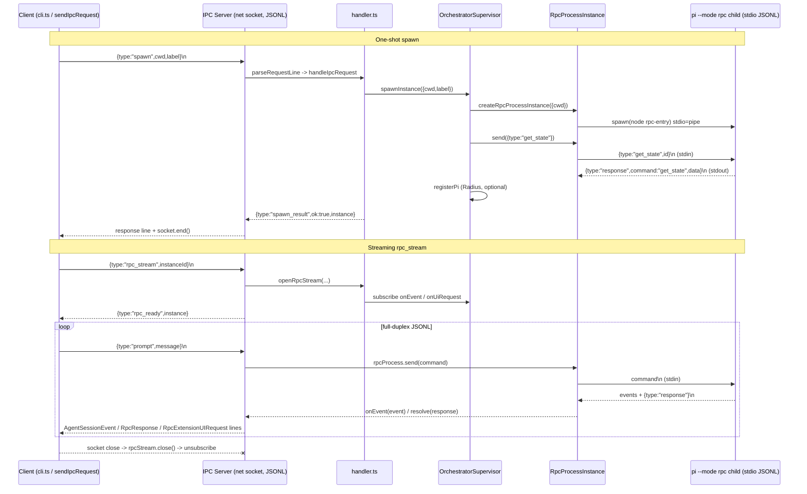

# Package Analysis: `packages/orchestrator`

> Source: `C:\Users\CharikshithPolimera\Downloads\PI_NEW\pi_space\pi\packages\orchestrator`
> npm name: `@earendil-works/pi-orchestrator` v0.80.10
> ~2,000 lines, 13 `.ts` files. ESM, `"type": "module"`, Node `>=22.19.0`.
> Sole runtime dependency: `@earendil-works/pi-coding-agent` (used for RPC type definitions and the child `rpc-entry` binary).

---

## 1. Purpose & Responsibilities

The orchestrator is an **experimental daemon that supervises multiple headless `pi` coding-agent processes** on a machine and exposes a single control-plane over a Unix-domain socket (named pipe on Windows). Its jobs:

1. Run a long-lived **`serve`** daemon (`serve.ts:9`) listening on `~/.pi/orchestrator/orchestrator.sock`.
2. **Spawn / stop / list / status** child agent "instances", each backed by one `pi --mode rpc` child process (`supervisor.ts`, `rpc-process.ts`).
3. **Bridge RPC** from external clients (CLI, other tools) to a specific child agent — both one-shot (`rpc`) and full-duplex streaming (`rpc-stream`) (`handler.ts`, `ipc/server.ts`).
4. **Persist** machine identity and instance metadata to JSON files so the daemon can recover after restart (`storage.ts`, `supervisor.recoverAfterRestart`).
5. Optionally register the machine and each agent instance with a remote **Radius** presence service (heartbeats, re-registration, backoff) so agents are discoverable/controllable remotely (`radius.ts`).

The central architectural idea: **the orchestrator is a fan-out message router**. Its own IPC socket carries a line-delimited JSON protocol; internally each agent child speaks the *coding-agent RPC protocol* (also line-delimited JSON) over stdio. The orchestrator translates between the two and multiplexes many children behind one socket.

---

## 2. Public API Surface

`index.ts` re-exports everything from `config`, `handler`, `ipc/client`, `ipc/protocol`, `ipc/server`, `rpc-process`, `serve`, `storage`, `supervisor`, `types`. Key exported symbols:

**config.ts**
- `const isBunBinary: boolean` — true when running as a Bun-compiled binary (detected via `import.meta.url` markers `$bunfs`/`~BUN`/`%7EBUN`) (`config.ts:16`).
- `const VERSION: string` (`config.ts:43`).
- `getOrchestratorDir(): string` — resolves `$PI_ORCHESTRATOR_DIR` → `$PI_CONFIG_DIR/orchestrator` → `~/.pi/orchestrator` (`config.ts:45`).
- `getAuthPath()`, `getMachinePath()`, `getInstancesPath()`, `getSocketPath()` (`config.ts:55-69`).

**ipc/protocol.ts**
- `encodeMessage(message: ProtocolMessage): string` → `JSON.stringify(message) + "\n"` (`protocol.ts:130`).
- `parseRequestLine(line): OrchestratorRequest`, `parseResponseLine(line): OrchestratorResponse` (`protocol.ts:134,139`).
- Types: `SpawnRequest`, `ListRequest`, `StopRequest`, `StatusRequest`, `RpcRequest`, `RpcStreamRequest`, `OrchestratorRequest`, `InstanceSummary`, `SpawnResponse`, `ListResponse`, `StopResponse`, `StatusResponse`, `RpcBridgeResponse`, `RpcReadyResponse`, `ErrorResponse`, `OrchestratorResponse`, `RpcClientMessage`, `RpcServerMessage`, `ProtocolMessage`, `ResponseFor<T>`.

**ipc/client.ts**
- `sendIpcRequest(request: OrchestratorRequest): Promise<OrchestratorResponse>` — connects, writes one request line, resolves on first response line (`client.ts:5`).

**ipc/server.ts**
- `startIpcServer(handler: IpcRequestHandler): Promise<Server>` (`server.ts:46`).
- `interface IpcRequestHandler` — overloaded callable + `openRpcStream(...)` method (`server.ts:25`).

**handler.ts**
- `handleIpcRequest(request): Promise<OrchestratorResponse>` (overloaded per request type) (`handler.ts:50-57`).
- `openRpcStream(instanceId, onResponse, onSessionEvent, onUiRequest)` → stream handle `{ handleRequest, close }` (`handler.ts:132`).

**rpc-process.ts**
- `class RpcProcessInstance` + `createRpcProcessInstance(options: { cwd }): RpcProcessInstance` (`rpc-process.ts:25,199`).

**serve.ts**
- `serve(): Promise<void>` — the daemon entry (`serve.ts:9`).

**supervisor.ts**
- `class OrchestratorSupervisor` + singleton `const supervisor` (`supervisor.ts:63,342`).

**storage.ts**
- `loadMachine`, `saveMachine`, `deleteMachine`, `loadInstances`, `saveInstances`, `getInstance`, `upsertInstance`, `removeInstance`.

**radius.ts**
- `getRadiusUrl`, `getRadiusOrchestratorBaseUrl`, `getRadiusAccessToken`, `isRadiusEnabled`, `class RadiusPresence` + singleton `radiusPresence`.

**types.ts**
- `type InstanceStatus`, `interface MachineRecord`, `interface RadiusRegistration`, `interface InstanceRecord`.

**cli.ts** — the `orchestrator` binary (not re-exported); `bin` entry, shebang `#!/usr/bin/env node`.

---

## 3. Process / Supervision Model

### Child process spawn (`rpc-process.ts`)
Each instance owns one `RpcProcessInstance` wrapping a `node:child_process` `spawn` with `stdio: ["pipe","pipe","pipe"]`, `cwd` = instance cwd, `env: process.env` (`rpc-process.ts:39`). The command chosen by `getSpawnCommand()` (`rpc-process.ts:50`):
- **Bun binary mode**: sibling `pi` / `pi.exe` next to `process.execPath`, args `["--mode","rpc"]`.
- **Node mode**: `process.execPath` (node) with arg `require.resolve("@earendil-works/pi-coding-agent/rpc-entry")`.

The class maintains: `pendingRequests: Map<id, {resolve,reject}>`, `eventListeners`, `exitListeners`, `uiRequestHandler`, and stdout/stderr line buffers. stdout is parsed line-by-line (`attachListeners`, `handleLine` `:63,101`):
- `type:"response"` with matching `id` → resolves the pending promise.
- `type:"extension_ui_request"` → forwarded to `uiRequestHandler`.
- anything else → treated as an `AgentSessionEvent` and broadcast to `eventListeners`.

`send(command)` assigns an id (`command.id ?? "orchestrator_<n>_<uuid>"`), writes `JSON.stringify(command)+"\n"` to stdin, and returns a promise resolved when the response arrives (`rpc-process.ts:143`). `handleUiResponse` writes a `RpcExtensionUIResponse` line to stdin (`:161`). `dispose()` rejects all pending, sends `SIGTERM`, and awaits `exit` (`:186`).

**On `error`/`exit`** the process is marked `exited`, all pending requests are rejected with a message that embeds captured stderr, and exit listeners fire (`rpc-process.ts:86-98`).

### Supervision (`supervisor.ts`)
`OrchestratorSupervisor` keeps a `Map<string, LiveInstance>` of in-memory live instances. A `LiveInstance` bundles the persisted `record`, live `resources` (rpcProcess, radiusPiId, sessionId), a `subscribers` set of event listeners, a `onUiRequest` callback, and unsubscribe handles (`supervisor.ts:15-28`).

- **`spawnInstance({cwd,label})`** (`:270`): create record with `randomUUID()`, status `starting`, persist; create `RpcProcessInstance`; `bindRpcProcess`; `syncInstanceRecord` (issues `get_state` to fetch sessionId/sessionFile); `radiusPresence.registerPi`; set status `online`. On any error → `failSpawn` (status error → cleanup → stopped → delete → rethrow).
- **`bindRpcProcess`** (`:99`): wires `onEvent` (broadcast to subscribers), `onExit` → `handleUnexpectedRpcExit`, and the child's UI-request handler.
- **Restart / crash policy**: **there is NO automatic restart.** `handleUnexpectedRpcExit` (`:115`) marks the instance `error`, clears bindings, drops the rpcProcess, disconnects Radius, and *removes* the live instance. Crash = terminal `error` state; the client must re-`spawn`. (Note this differs from `stopInstance`, which also `removeInstance`s from persisted storage.)
- **`stopInstance`** (`:300`): status `stopping` → `cleanupAcquiredResources` (unbind, Radius disconnect, `rpcProcess.dispose()` = SIGTERM) → status `stopped` → delete live + `removeInstance` from disk.
- **`recoverAfterRestart`** (`:244`): on daemon boot, load persisted instances, downgrade any `online`/`starting` to `stopped` (their child processes died with the old daemon), Radius-disconnect each, and re-save. Live children are NOT re-attached (the OS killed them), so recovery is metadata-only.
- **`shutdown`** (`:335`): stop every live instance.
- **`syncInstanceRecord`** / `SESSION_METADATA_COMMANDS` (`:41`): after `new_session`/`switch_session`/`fork`/`clone`/`set_session_name`/`prompt`, re-issue `get_state` to refresh persisted `sessionId`/`sessionFile`. Other RPCs skip this to avoid wasteful IO.

---

## 4. IPC & RPC Protocol

### Transport
- **Orchestrator control plane**: a single `node:net` server bound to the filesystem socket path (`getSocketPath()` → `~/.pi/orchestrator/orchestrator.sock`). On Windows this is a named pipe path string handed to `net.createServer().listen()`. Wire format: **newline-delimited JSON** (`encodeMessage` = `JSON.stringify + "\n"`).
- **Orchestrator ↔ agent child**: the child's **stdin/stdout**, also newline-delimited JSON, speaking the coding-agent RPC protocol (`rpc-types.ts`). stderr is buffered for error diagnostics.

### Two request modes on the socket
1. **One-shot** (`spawn`, `list`, `stop`, `status`, `rpc`): server reads one request line, calls `handleIpcRequest`, then `socket.end(encodeMessage(response))` — one request, one response, socket closed (`server.ts:138`, `client.ts`).
2. **Streaming** (`rpc_stream`): after the initial `rpc_ready` response the server *removes* the one-shot data listener and installs a streaming one. The client then sends JSONL `RpcCommand` / `extension_ui_response` lines; the server pushes back `RpcResponse`, `AgentSessionEvent`, and `RpcExtensionUIRequest` lines until the socket closes (`server.ts:68-135`). Inbound RPC lines are serialized through a promise chain (`rpcRequestQueue`) so commands to the child are processed in order. `socket.once("close", …)` calls `rpcStream.close()` to unsubscribe.

### Message type catalog
- **`OrchestratorRequest`** (`protocol.ts:52`): `spawn` | `list` | `stop` | `status` | `rpc` | `rpc_stream`.
- **`OrchestratorResponse`** (`protocol.ts:114`): `spawn_result` | `list_result` | `stop_result` | `status_result` | `rpc_result` | `rpc_ready` | `error`. Every response has `ok: boolean` + optional `error`.
- **`RpcClientMessage`** = `RpcCommand | RpcExtensionUIResponse` (client→child, during stream).
- **`RpcServerMessage`** = `RpcReadyResponse | RpcResponse | AgentSessionEvent | RpcExtensionUIRequest | ErrorResponse` (child→client, during stream).
- Underlying `RpcCommand`/`RpcResponse` (imported from coding-agent, `rpc-types.ts:20,114`): commands like `prompt`, `steer`, `follow_up`, `abort`, `new_session`, `get_state`, `set_model`, `compact`, `bash`, `switch_session`, `fork`, `clone`, `get_entries`, `get_tree`, `set_session_name`, `get_messages`, etc. Responses are tagged `{type:"response", command, success, id?, data?}`; UI requests are `select`/`confirm`/`input`/`editor`/`notify`/`setStatus`/`setWidget`/`setTitle`/`set_editor_text` (`rpc-types.ts:230`).

### Stale-socket / single-instance guard
`removeStaleSocketIfNeeded` (`server.ts:162`): if the socket file exists, `isSocketLive` tries to connect. Live → throw "orchestrator is already running". Dead (`ECONNREFUSED`/`ENOENT`/`EPIPE`/`ECONNRESET`) → `unlinkSync` the stale file and continue.

### Mermaid: orchestrator ↔ worker communication



---

## 5. Storage (`storage.ts`)

Plain JSON files under `getOrchestratorDir()`, created lazily via `ensureOrchestratorDir` (`mkdirSync recursive`). Written with `writeFileSync(..., JSON.stringify(x, null, 2))` — **non-atomic, no locking**.

- **`machine.json`** (`MachineRecord`): `{id, createdAt, lastSeenAt?, label?}` — the Radius machine identity, reused across restarts so re-registration keeps the same id. `load/save/deleteMachine`.
- **`instances.json`** (`InstanceRecord[]`): the full list of instances. `loadInstances`, `saveInstances`, `getInstance(id)` (linear find), `upsertInstance` (find-by-id then replace or push), `removeInstance` (filter out).
- **`auth.json`** path is exposed (`getAuthPath`) but Radius actually reads credentials via `readStoredCredential("radius")` from the coding-agent package, not this file directly.

The supervisor treats `instances.json` as the source of truth for `list`/`status` of non-live (stored) instances, while the in-memory `liveInstances` map holds runtime state. Every status/record mutation calls `upsertInstance`, keeping disk in sync on each transition.

---

## 6. `radius.ts` / `serve.ts` / `handler.ts`

### `handler.ts` — request dispatcher
Pure translation layer between the IPC protocol and the supervisor. `handleIpcRequest` switch: `spawn`→`spawnInstance`, `list`→`listInstances`, `status`→`getInstance`, `stop`→`stopInstance`, `rpc`→`handleRpc`, `rpc_stream`→verify instance exists and return `rpc_ready`. `toInstanceSummary` projects `InstanceRecord`→`InstanceSummary`. `unknownInstanceError` returns a standard error. `openRpcStream` adapts the supervisor's stream handle into the `{handleRequest, close}` shape the IPC server expects, routing `extension_ui_response` to `handleUiResponse` and everything else to `handleRpc` (then emitting the response) (`handler.ts:132-161`).

### `serve.ts` — daemon lifecycle
`serve()`: mkdir socket dir; `startIpcServer(Object.assign(handleIpcRequest, {openRpcStream}))` — note the handler function is *augmented* with the `openRpcStream` method to satisfy `IpcRequestHandler`. Then `supervisor.recoverAfterRestart()`; if `isRadiusEnabled()` start `radiusPresence` and log the machine id. On startup error, close server + unlink socket + rethrow. Installs `SIGINT`/`SIGTERM`/`uncaughtException`/`unhandledRejection` handlers that run an idempotent `shutdown(exitCode)` (guarded by a single `shutdownPromise`): close server, `supervisor.shutdown()`, `radiusPresence.stop()`, unlink socket, `process.exit`. Finally awaits a never-resolving promise to stay alive (`serve.ts:74`).

### `radius.ts` — remote presence
Optional integration with a remote Radius service (default `https://radius.pi.dev/`, base `/v1/`; overridable via `PI_RADIUS_URL` / `PI_RADIUS_ORCHESTRATOR_URL`). Auth via stored OAuth credential (`readStoredCredential("radius")`) or `RADIUS_API_KEY` (`getRadiusAccessToken`, `isRadiusEnabled`). Uses `fetch` for HTTP POST (`post`/`maybePost`) with `RadiusHttpError` carrying status.

`class RadiusPresence` (singleton `radiusPresence`) manages:
- **Machine registration** (`registerMachine` → `POST machines/register`, reusing stored `machine.id`) + **machine heartbeat** (`POST machines/{id}/heartbeat` with cwd + socketPath).
- **Pi (instance) registration** (`registerPi` → `POST pis/register` with machineId, label, cwd, hostname, pid, `transport:"local-rpc"`, `capabilities:{rpc:true,relay:false,iroh:false}`, sessionId) + **per-Pi heartbeat** (`POST pis/{id}/heartbeat`).
- **Disconnect**: `POST machines/{id}/disconnect`, `POST pis/{id}/disconnect` (404 tolerated).
- **Resilience**: exponential backoff with jitter (`computeBackoffDelayMs`, base 1s, max 30s); on `NOT_FOUND_RETRY_THRESHOLD`(3) consecutive 404s, **re-register** the machine and all live Pis (`reRegisterMachineAndPis`/`reRegisterPi`). All heartbeats are self-rescheduling `setTimeout` loops keyed per-instance in `piHeartbeatStates`.
- **Coordinator bridge**: `setCoordinator` (wired in `supervisor.ts:344`) lets Radius call back into the supervisor to list/get/update live instances during re-registration — decoupling the two singletons to avoid a circular import.

---

## 7. Key Data Types (`types.ts` + `protocol.ts`)

```ts
type InstanceStatus = "starting" | "online" | "stopping" | "stopped" | "error";

interface MachineRecord { id; createdAt; lastSeenAt?; label?; }              // all string

interface RadiusRegistration { heartbeatIntervalMs: number; expiresInMs: number; }

interface InstanceRecord {
  id; status: InstanceStatus; cwd; createdAt;
  lastSeenAt?; label?; sessionId?; sessionFile?; radiusPiId?;               // strings
}

interface InstanceSummary { id; status; cwd; label?; sessionId?; sessionFile?; radiusPiId?; }
```

Internal (`supervisor.ts`): `LiveInstanceResources {rpcProcess?, radiusPiId?, sessionId?}`, `LiveInstance {record, resources, subscribers:Set, onUiRequest?, unsubscribeEvents?, unsubscribeExit?}`. `PiHeartbeatState {timer?, intervalMs, radiusPiId, consecutiveNotFoundCount, transientFailureCount}` (`radius.ts:29`).

`RpcCommand`, `RpcResponse`, `AgentSessionEvent`, `RpcExtensionUIRequest/Response`, `RpcSessionState` are imported from `@earendil-works/pi-coding-agent` (defined in `packages/coding-agent/src/modes/rpc/rpc-types.ts`). Timestamps are ISO-8601 strings (`new Date().toISOString()`). Ids are `randomUUID()`.

---

## 8. External Dependencies → Rust Crate Equivalents

| TS / Node API | Usage | Rust equivalent |
|---|---|---|
| `node:child_process.spawn` (stdio pipe) | spawn `pi --mode rpc` child | `tokio::process::Command` with `Stdio::piped()` |
| `node:net` server/`createConnection` (unix socket / named pipe) | control-plane IPC | `tokio::net::UnixListener`/`UnixStream` (unix); `tokio::net::windows::named_pipe` (Windows) — or `interprocess` crate for cross-platform local sockets |
| `node:crypto.randomUUID` | instance ids, request ids | `uuid` crate (`Uuid::new_v4()`) |
| `JSON.stringify` / `JSON.parse` | wire format + storage | `serde` + `serde_json` |
| `fetch` (Radius HTTP) | machine/Pi registration + heartbeat | `reqwest` (async) |
| `node:fs` sync (`readFileSync`/`writeFileSync`/`existsSync`/`mkdirSync`/`unlinkSync`/`rmSync`) | JSON storage, socket cleanup | `std::fs` / `tokio::fs`; use `tempfile` + rename for atomic writes |
| `node:os` (`homedir`,`hostname`,`platform`) | paths + registration metadata | `dirs`/`home` crate; `hostname` crate; `std::env::consts::OS`/`ARCH` |
| `setTimeout`/`clearTimeout` (heartbeat loops) | Radius heartbeats + backoff | `tokio::time::sleep` inside spawned tasks + `tokio::select!`/`CancellationToken`, or `tokio_util` `DelayQueue` |
| line-delimited JSON framing | both protocols | `tokio_util::codec::LinesCodec` + `Framed`, or `BufReader::read_line` |
| `process.on(SIGINT/SIGTERM)` | graceful shutdown | `tokio::signal::unix::signal` / `ctrl_c` |
| `NodeJS.Timeout`, promise queue (`rpcRequestQueue`) | ordered RPC dispatch | `tokio::sync::mpsc` channel processed serially, or `Mutex`-guarded sequence |
| `readStoredCredential` (from coding-agent) | Radius OAuth | shared credential crate in the Rust port |

Note: the child `rpc-entry` is itself a coding-agent binary; in the Rust port the spawned child will be the ported `pi` binary invoked with `--mode rpc` (mirroring the Bun-binary path in `getSpawnCommand`, `rpc-process.ts:50`).

---

## 9. Rust Porting Notes

### Process supervision
- Model `RpcProcessInstance` as a struct owning a `tokio::process::Child`, with a background task reading stdout lines. Because callers need request/response correlation *and* event broadcast, use:
  - `pending: Arc<Mutex<HashMap<String, oneshot::Sender<RpcResponse>>>>` for id-correlated responses.
  - a `tokio::sync::broadcast` (or `Vec<mpsc::Sender>`) for `AgentSessionEvent` subscribers.
  - a `watch`/`oneshot` for exit notification; on exit, drain `pending` and reject with a stderr-embedded error (mirror `rpc-process.ts:86-98`).
- `send()` → assign id, serialize + `\n`, `write_all` to stdin, register a `oneshot`, `.await` it. `dispose()` → send `SIGTERM` (`child.start_kill()` / `nix::kill`) and await `child.wait()`.
- **No auto-restart** — preserve exactly: an unexpected exit transitions the instance to `error` and removes it from the live map (`supervisor.ts:115`). Do not add restart logic.
- stderr must be continuously drained into a buffer even though it's only surfaced on error (avoid pipe backpressure deadlock — a real risk in Rust with fixed OS pipe buffers).

### IPC / RPC framing
- One `Framed<UnixStream, LinesCodec>` per connection. Dispatch on the `type` tag deserialized via `serde` tagged enums (`#[serde(tag = "type")]`). The protocol maps cleanly to Rust enums: `OrchestratorRequest`, `OrchestratorResponse`, `RpcClientMessage`, `RpcServerMessage`.
- Reproduce the **two-phase connection**: first line dispatched as `OrchestratorRequest`; for `rpc_stream`, keep the connection open and switch into a full-duplex loop. Use `tokio::select!` between "inbound socket lines" and "outbound child events/responses", with an ordered inbound queue (a single consumer task) to match `rpcRequestQueue`'s serialization guarantee (`server.ts:96-133`).
- **Cross-platform socket**: `#[cfg(unix)]` `UnixListener` vs `#[cfg(windows)]` named pipes; the `interprocess` crate (`LocalSocketListener`) abstracts both and is the pragmatic choice. Replicate the stale-socket liveness probe (`server.ts:162`): try to connect; if refused, delete and rebind; if connected, error "already running".
- Serde design: because the coding-agent RPC types are large tagged unions with a shared `id?`, model them as `#[serde(tag = "type", rename_all = "snake_case")]` enums; responses additionally discriminate on a `command` + `success` field — use `#[serde(untagged)]` or a two-level enum. Preserve `id?` optionality and the `orchestrator_<n>_<uuid>` id-generation scheme.

### Node-specific IPC that needs a different approach
- The child uses **plain stdio pipes**, not Node's `child_process.fork` IPC channel or `MessagePort` — so there is **no Node-specific IPC to reimplement**; ordinary `Stdio::piped()` suffices. This is favorable for the port.
- `import.meta.url` Bun-binary detection (`config.ts:16`) has no Rust analog; replace with a compile-time/`std::env::current_exe()`-based check that locates the sibling `pi` binary.
- `require.resolve("@earendil-works/pi-coding-agent/rpc-entry")` (Node module resolution) must be replaced by a direct path to the ported binary (self-exec with `--mode rpc`, or a sibling-binary lookup).
- Radius heartbeat `setTimeout` self-scheduling loops → per-instance `tokio::task` holding a `CancellationToken`; keep the exact backoff formula (`base=1s`, `max=30s`, `2^(n-1)`, jitter `rand(0..max(250, delay/4))`) and the 3-consecutive-404 re-register threshold.

### Proposed Rust module / crate layout
```
crates/pi-orchestrator/
  src/
    lib.rs            # re-exports (mirrors index.ts)
    config.rs         # dirs, paths, VERSION, bun/binary detection
    types.rs          # InstanceStatus, MachineRecord, InstanceRecord, RadiusRegistration (+ serde)
    storage.rs        # JSON load/save/upsert/remove (atomic writes)
    ipc/
      mod.rs
      protocol.rs     # Request/Response enums, encode/parse (serde), ProtocolMessage
      server.rs       # LocalSocketListener, two-phase + streaming loop, stale-socket probe
      client.rs       # send_ipc_request
    rpc_process.rs    # RpcProcessInstance (tokio::process, oneshot map, broadcast events)
    supervisor.rs     # OrchestratorSupervisor (DashMap/Mutex<HashMap> of live instances)
    radius.rs         # RadiusPresence (reqwest, heartbeat tasks, backoff, coordinator trait)
    handler.rs        # dispatch OrchestratorRequest -> supervisor
    serve.rs          # daemon: bind, recover, signals, graceful shutdown
  src/bin/orchestrator.rs   # cli.ts equivalent (clap): serve/list/spawn/status/stop/rpc/rpc-stream
```
Use a shared workspace crate for the coding-agent RPC types (`RpcCommand`/`RpcResponse`/`AgentSessionEvent`/`RpcExtensionUI*`) so both the orchestrator and the ported coding-agent depend on one definition. The `supervisor`/`radiusPresence` singletons become a shared `Arc<...>` wired at startup; the `RadiusPresenceCoordinator` callback interface (`supervisor.ts:344`) becomes a trait object to break the cycle, exactly as in TS.

### Porting gotchas / fidelity checklist
1. Storage writes are non-atomic and unlocked in TS — the port *may* improve to atomic rename, but behavior under concurrent daemon instances is already guarded by the single-socket lock, so a single writer is assumed.
2. `recoverAfterRestart` downgrades `online`/`starting`→`stopped` and does NOT re-attach children — keep this; children are dead after a daemon restart.
3. `stopInstance` removes from disk (`removeInstance`), but `handleUnexpectedRpcExit` does NOT — a crashed instance lingers in `instances.json` as `error`. Preserve this asymmetry.
4. Session-metadata refresh is *selective* (`SESSION_METADATA_COMMANDS`, `supervisor.ts:41`) — replicate the exact command set to match IO behavior.
5. The inbound RPC queue in the stream path guarantees ordered delivery to the child; a naive concurrent Rust implementation would break ordering.
