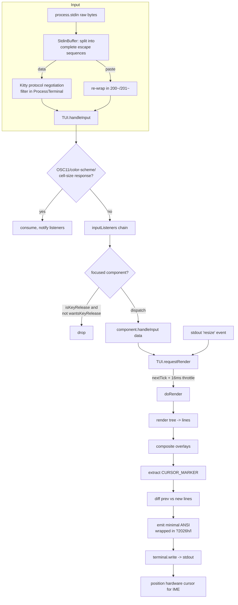

# Package Analysis: `packages/tui` — Pi Terminal UI

> Source: `packages/tui` (`@earendil-works/pi-tui` v0.80.10), ~12,200 lines / 28 files.
> Author's own tagline: *"Terminal User Interface library with differential rendering for efficient text-based applications."*
> This is a **standalone, self-contained TUI library** that hand-rolls everything down to the ANSI bytes. There is **no TUI framework dependency** (no blessed/ink/ratatui equivalent). Only two runtime deps: `get-east-asian-width` and `marked`.

---

## 1. Purpose & Responsibilities

`pi-tui` is the presentation layer for the Pi agent CLI. It provides:

1. **A differential (inline) renderer** (`tui.ts`) — draws components into the *normal* terminal buffer (not the alternate screen), diffs frame-to-frame, and emits the minimal ANSI needed to update. Content scrolls into scrollback like normal shell output.
2. **A component model** (`Component`, `Container`, `Focusable`) — components are pure `render(width) => string[]` functions plus optional `handleInput(data)`.
3. **An overlay/modal system** — a focus-managed stack composited on top of base content (`showOverlay`, anchors, margins, percentage sizing).
4. **A production-grade multi-line line editor** (`components/editor.ts`, 2333 lines) — grapheme-aware cursor movement, word navigation, kill-ring, undo, prompt history, character-jump, bracketed paste with large-paste markers, and async autocomplete.
5. **Robust cross-terminal keyboard input** (`keys.ts`, `stdin-buffer.ts`) — Kitty keyboard protocol, xterm `modifyOtherKeys`, and legacy escape sequences, plus batched-input splitting and bracketed paste.
6. **Terminal feature integration** — truecolor detection, OSC 8 hyperlinks, OSC 11 background-color query, color-scheme (dark/light) notifications, OSC 9;4 progress, and **inline images** (Kitty graphics + iTerm2).
7. **A library of ready-made components** — `Box`, `Text`, `TruncatedText`, `Spacer`, `Loader`, `Image`, `Markdown`, `SelectList`, `SettingsList`, `Input`, `Editor`.

The package is deliberately decoupled: `Terminal` is an interface (`terminal.ts`) so the renderer can be driven by `ProcessTerminal` (real stdio) or a test double (`@xterm/headless` is a dev dependency used for tests).

---

## 2. Public API Surface (`index.ts`)

Re-exports (signatures condensed):

**Core (`tui.ts`)**
- `class TUI extends Container` — main loop. Key methods: `constructor(terminal: Terminal, showHardwareCursor?: boolean)`, `start()`, `stop()`, `requestRender(force?: boolean)`, `setFocus(c: Component|null)`, `showOverlay(c, opts?): OverlayHandle`, `hideOverlay()`, `hasOverlay()`, `addInputListener(fn): () => void`, `onTerminalColorSchemeChange(fn)`, `setTerminalColorSchemeNotifications(bool)`, `queryTerminalBackgroundColor({timeoutMs}): Promise<RgbColor|undefined>`, `queryTerminalColorScheme({timeoutMs})`, `onDebug?: () => void`, `get fullRedraws`.
- `class Container implements Component` — `addChild/removeChild/clear/render/invalidate`.
- `interface Component { render(width): string[]; handleInput?(data); wantsKeyRelease?: boolean; invalidate(): void }`
- `interface Focusable { focused: boolean }`, `function isFocusable(c): c is Component & Focusable`
- `const CURSOR_MARKER` (APC sentinel `\x1b_pi:c\x07`), `visibleWidth` (re-export)
- Overlay types: `OverlayAnchor`, `OverlayMargin`, `OverlayOptions`, `OverlayHandle`, `OverlayUnfocusOptions`, `SizeValue`.

**Terminal (`terminal.ts`)**: `interface Terminal`, `class ProcessTerminal implements Terminal`.

**Keys (`keys.ts`)**: `type KeyId`, `const Key`, `matchesKey(data, keyId): boolean`, `parseKey(data): string|undefined`, `decodePrintableKey(data)`, `decodeKittyPrintable(data)`, `isKeyRelease(data)`, `isKeyRepeat(data)`, `setKittyProtocolActive/isKittyProtocolActive`, `type KeyEventType`.

**Keybindings (`keybindings.ts`)**: `class KeybindingsManager`, `TUI_KEYBINDINGS`, `type Keybinding/Keybindings/KeybindingDefinition(s)/KeybindingsConfig/KeybindingConflict`, `getKeybindings()/setKeybindings()`.

**Input (`stdin-buffer.ts`)**: `class StdinBuffer`, `StdinBufferOptions`, `StdinBufferEventMap`.

**Fuzzy (`fuzzy.ts`)**: `fuzzyMatch(query,text): FuzzyMatch`, `fuzzyFilter<T>(items, query, getText): T[]`.

**Autocomplete (`autocomplete.ts`)**: `interface AutocompleteProvider`, `AutocompleteItem`, `AutocompleteSuggestions`, `SlashCommand`, `class CombinedAutocompleteProvider`.

**Colors (`terminal-colors.ts`)**: `RgbColor`, `TerminalColorScheme`, `isOsc11BackgroundColorResponse`, `parseOsc11BackgroundColor`, `parseTerminalColorSchemeReport`.

**Images (`terminal-image.ts`)**: `ImageProtocol`, `TerminalCapabilities`, `detectCapabilities/getCapabilities/setCapabilities/resetCapabilitiesCache`, `getCellDimensions/setCellDimensions`, `isImageLine`, `allocateImageId`, `encodeKitty`, `deleteKittyImage`, `deleteAllKittyImages`, `encodeITerm2`, `renderImage`, `calculateImageCellSize/calculateImageRows`, `getImageDimensions` (+ png/jpeg/gif/webp), `hyperlink(text,url)`, `imageFallback`.

**Utils (`utils.ts`)**: `visibleWidth`, `truncateToWidth`, `sliceByColumn`, `wrapTextWithAnsi` (plus internal `sliceWithWidth`, `extractSegments`, `normalizeTerminalOutput`, segmenters, `PUNCTUATION_REGEX`, `cjkBreakRegex`).

**Editor interface (`editor-component.ts`)**: `interface EditorComponent extends Component` (getText/setText/handleInput/onSubmit/onChange + optional addToHistory/insertTextAtCursor/getExpandedText/setAutocompleteProvider/borderColor/setPaddingX/setAutocompleteMaxVisible) — the seam that lets extensions swap in a custom editor (vim/emacs).

**Components**: `Box`, `CancellableLoader`, `Editor`(+`EditorOptions`,`EditorTheme`), `Image`(+`ImageOptions`,`ImageTheme`), `Input`, `Loader`(+`LoaderIndicatorOptions`), `Markdown`(+`MarkdownOptions`,`MarkdownTheme`,`DefaultTextStyle`), `SelectList` (+`SelectItem`,`SelectListTheme`,`SelectListLayoutOptions`,...), `SettingsList`(+`SettingItem`,`SettingsListTheme`), `Spacer`, `Text`, `TruncatedText`.

---

## 3. Rendering Model

**Hand-rolled raw ANSI with a line-based differential renderer.** There is no framework, no cell/grid buffer, and no alternate screen. The unit of rendering is a **line** (`string`); a component renders to `string[]`.

### Frame pipeline (`TUI.doRender`, `tui.ts:1254`)
1. `render(width)` walks the component tree and concatenates each child's lines (`Container.render`, `tui.ts:280`).
2. If overlays exist, they are composited into the line buffer (`compositeOverlays`, `tui.ts:1032`): each overlay is rendered at its resolved width, clamped to `maxHeight`, positioned by anchor/margin/percent (`resolveOverlayLayout`, `tui.ts:897`), and spliced column-accurately into base lines (`compositeLineAt`, `tui.ts:1176`, using `extractSegments`/`sliceWithWidth`).
3. The hardware-cursor position is extracted by finding `CURSOR_MARKER` and computing its visible column (`extractCursorPosition`, `tui.ts:1234`); the marker is then stripped.
4. Each line gets a reset suffix `\x1b[0m\x1b]8;;\x07` and normalization (`applyLineResets`, `tui.ts:1095`).
5. **Diff**: scan `previousLines` vs `newLines` for `firstChanged`/`lastChanged` (`tui.ts:1368`). Only that range is redrawn; the cursor is moved there with relative CSI (`\x1b[<n>A/B`, `\r`), each changed line is cleared (`\x1b[2K`) and rewritten, extra old lines are cleared. The whole buffer is wrapped in **synchronized output** `\x1b[?2026h … \x1b[?2026l` to prevent tearing.
6. **Full redraw** (`fullRender`, `tui.ts:1284`, `\x1b[2J\x1b[H\x1b[3J`) is triggered on first render, width change (wrapping changes), height change (except Termux where the soft-keyboard toggles height), `clearOnShrink`, or when a change is above the previous viewport top.

Extra machinery: viewport/scroll tracking (`previousViewportTop`, `maxLinesRendered`, `hardwareCursorRow` vs logical `cursorRow`), Kitty-image reserved-row expansion and deletion (`tui.ts:1106–1173`), a **width-overflow guard** that dumps a crash log and throws if any rendered line exceeds terminal width (`tui.ts:1520`), and render coalescing: `requestRender` batches via `process.nextTick`, throttled to `MIN_RENDER_INTERVAL_MS = 16` (`tui.ts:741`).

### Render / Input loop



---

## 4. Input Handling

**Raw mode** (`ProcessTerminal.start`, `terminal.ts:134`): `setRawMode(true)`, UTF-8 encoding, `resume()`, enables bracketed paste (`\x1b[?2004h`), registers `resize`, sends `SIGWINCH` to refresh dims (Unix), enables Windows VT input, then negotiates the Kitty protocol.

**StdinBuffer (`stdin-buffer.ts`)** — adapted from OpenTUI. stdin `data` events can arrive fragmented; the buffer accumulates bytes and emits **one complete escape sequence at a time** so `matchesKey`/`isKeyRelease` see single events. It classifies CSI/OSC/DCS/APC/SS3 and knows when each is complete (`isCompleteSequence`, `:29`), handles old- and SGR-style mouse, high-byte→`ESC` meta conversion, a WezTerm `\x1b\x1b[...` split-escape edge case (`:217`), and **bracketed paste** state (buffers between `200~`/`201~`, emits a `paste` event). A 10 ms timeout flushes incomplete buffers. It also suppresses a duplicated raw codepoint that follows a Kitty CSI-u printable (`emitDataSequence`, `:389`).

**Kitty keyboard protocol negotiation** (`terminal.ts:220`): writes `\x1b[>7u\x1b[?u\x1b[c` (request flags 1|2|4 = disambiguate + event-types + alternate-keys, then query, then DA as a sentinel). If a Kitty-flags reply arrives → enable Kitty mode (`setKittyProtocolActive(true)`); if DA arrives first → fall back to xterm `modifyOtherKeys` (`\x1b[>4;2m`). Split responses are buffered with a 150 ms fragment timeout (`:295`). On `stop()`/`drainInput()` it pops the protocol (`\x1b[<u`) and drains stdin to stop Kitty key-release events leaking to the parent shell over SSH.

**Key parsing (`keys.ts`, 1401 lines)** — three input encodings unified:
- **Kitty CSI-u**: `\x1b[<cp>[:<shifted>[:<base>]];<mod>[:<event>]u` (`parseKittySequence`, `:587`); modifiers bitmask `shift=1,alt=2,ctrl=4,super=8`, lock mask `64|128` ignored; functional-key codepoint normalization (numpad → base keys), shifted-letter identity normalization, and **base-layout-key** fallback for non-Latin/remapped layouts (only when the codepoint isn't a known Latin letter/symbol — guards against Dvorak/Colemak false matches).
- **xterm modifyOtherKeys**: `\x1b[27;<mod>;<cp>~` (`:696`).
- **Legacy** sequences: large tables `LEGACY_KEY_SEQUENCES`, `LEGACY_SHIFT/CTRL_SEQUENCES`, `LEGACY_SEQUENCE_KEY_IDS` plus per-key special cases (arrows, home/end variants, `\x1b[Z` shift-tab, alt=ESC-prefix, raw ctrl chars via `code & 0x1f`, ambiguous `0x08` backspace resolved by Windows-Terminal heuristic).
- Public API: `matchesKey(data, keyId)`, `parseKey(data)`, `decodePrintableKey`/`decodeKittyPrintable` (extract a typeable char from CSI-u, accepting only plain/Shift), `isKeyRelease`/`isKeyRepeat` (quick `:3`/`:2` substring checks, paste-aware).

**Keybindings (`keybindings.ts`)**: `TUI_KEYBINDINGS` maps semantic IDs (`tui.editor.*`, `tui.input.*`, `tui.select.*`) to default `KeyId`(s). `KeybindingsManager` merges user overrides, detects conflicts, and exposes `matches(data, id)` (loops candidate keys through `matchesKey`). A module-global instance is used by the editor. Designed for downstream declaration-merging so other packages add their own bindings.

**Native modifiers (`native-modifiers.ts`)**: optional macOS-only native addon (`native/darwin/prebuilds/.../darwin-modifiers.node`) exposing `isModifierPressed(shift|command|control|option)`. Used only to distinguish Shift+Enter on Apple Terminal (which can't report it). Fails closed to `false`. Similarly, `terminal.ts:338` loads a Windows `win32-console-mode.node` addon to set `ENABLE_VIRTUAL_TERMINAL_INPUT` so the console emits VT sequences (e.g. `\x1b[Z`) instead of dropping modifiers.

---

## 5. The Line Editor (`components/editor.ts`)

The `Editor` (`implements Component, Focusable`, 2333 lines) is the crown jewel. State is minimal: `{ lines: string[]; cursorLine: number; cursorCol: number }` (`:253`). All complexity is in transforms.

- **Grapheme/word segmentation**: uses `Intl.Segmenter` via `utils.getGraphemeSegmenter/getWordSegmenter`, wrapped by `segmentWithMarkers` (`:39`) which merges `[paste #N …]` markers into single **atomic segments** so cursor movement/deletion/word-wrap treat a paste marker as one unit.
- **Layout & word-wrap**: `wordWrapLine` (`:114`, exported) wraps at whitespace/CJK boundaries with char-level fallback; `layoutText` (`:881`) produces `LayoutLine[]` (text + cursor pos). `buildVisualLineMap` (`:1716`) maps visual lines → logical `(line,startCol,length)`.
- **Cursor movement**: `moveCursor` (`:1774`) moves by grapheme horizontally and by *visual* line vertically. Vertical movement uses a **sticky preferred column** (`preferredVisualCol`) with a documented 7-case decision table (`computeVerticalMoveColumn`, `:1461`), and **snaps** to atomic-segment boundaries (`snappedFromCursorCol`, `moveToVisualLine`, `:1359`). Word nav delegates to `word-navigation.ts` (`findWordBackward/Forward`, Intl.Segmenter + `PUNCTUATION_REGEX`, marker-aware).
- **Kill ring (`kill-ring.ts`)**: Emacs-style ring; `push({prepend, accumulate})` merges consecutive kills; `peek`/`rotate`. Wired to `deleteToLineStart/End`, `deleteWord*`, and `yank`/`yankPop` (`:1878`) which track `lastAction` to allow yank-pop cycling.
- **Undo (`undo-stack.ts`)**: `UndoStack<EditorState>` stores `structuredClone` snapshots; **coalescing** — consecutive word chars form one undo unit, whitespace/actions break the unit (`insertCharacter`, `:1084`).
- **History**: in-editor prompt history (`navigateHistory`, `:409`) triggered by Up/Down on the first/last visual line; captures a draft, caps at 100 entries.
- **Bracketed paste**: buffers `200~…201~`; decodes tmux-reencoded CSI-u ctrl bytes; filters non-printables; large pastes (>10 lines or >1000 chars) are stored in a `Map<id,content>` and replaced by a `[paste #N +K lines]` marker, expanded on submit via `getExpandedText`.
- **Character jump mode**: `Ctrl+]` / `Ctrl+Alt+]` then a char jumps to next/prev occurrence multi-line (`jumpToChar`, `:2016`).
- **Autocomplete integration**: async, debounced (`ATTACHMENT_AUTOCOMPLETE_DEBOUNCE_MS=20`), `AbortController`-cancelled, serialized via a promise chain, and validated against a text/cursor snapshot before applying (`runAutocompleteRequest`, `:2224`). Auto-triggers for `/` slash commands (line 0 only), `@`/`#`/provider trigger chars at token boundaries, and continuation typing. Renders an embedded `SelectList` under the editor.
- **Rendering** (`render`, `:464`): draws top/bottom horizontal borders (with `↑ N more` / `↓ N more` scroll indicators), a viewport limited to `max(5, 30% of terminal rows)` with `scrollOffset`, the cursor as a reverse-video (`\x1b[7m`) grapheme (or trailing space), and emits `CURSOR_MARKER` when focused for IME positioning.

---

## 6. Components (`components/`)

| Component | File / lines | Role |
|---|---|---|
| `Text` | text.ts (106) | Wrapped multi-line text, paddingX/Y, optional bg fn. Base class for `Loader`. |
| `TruncatedText` | truncated-text.ts (65) | Single line truncated to width. |
| `Spacer` | spacer.ts (28) | N blank lines. |
| `Box` | box.ts (137) | Bordered/padded container region with optional background. |
| `Loader` / `CancellableLoader` | loader.ts (92) / cancellable-loader.ts (40) | Animated spinner (extends `Text`); cancellable variant consumes a key to cancel. |
| `Image` | image.ts (126) | Renders an image via `terminal-image` (Kitty/iTerm2) with fallback text; theme-aware. |
| `Markdown` | markdown.ts (858) | Full markdown renderer built on `marked`; themable heading/code/list/quote styles, syntax-ish styling, wrapping. The heaviest non-editor component. |
| `SelectList` | select-list.ts (229) | Scrollable single-select list with fuzzy-filter support, two-column layout options; used by editor autocomplete. |
| `SettingsList` | settings-list.ts (250) | Interactive key/value settings editor list. |
| `Input` | input.ts (447) | Single-line focusable input (a lighter sibling of `Editor`). |
| `Editor` | editor.ts (2333) | The multi-line line editor (section 5). |

All implement `render(width): string[]`; focusable/interactive ones add `handleInput`. None hold a screen buffer — they are pure line producers, which is what makes the differential renderer possible.

---

## 7. Terminal Features

- **Colors (`terminal-colors.ts`)**: parse OSC 11 background-color replies (`#rrggbb`, 12-hex, `rgb:`) → `RgbColor`; parse color-scheme DSR report `CSI ? 997 ; {1|2} n` → `dark|light`. `TUI` drives these via `queryTerminalBackgroundColor` (`\x1b]11;?\x07`) and `queryTerminalColorScheme` (`\x1b[?996n`), plus opt-in change notifications (`\x1b[?2031h/l`).
- **Truecolor / hyperlinks**: `detectCapabilities` (`terminal-image.ts:65`) sniffs `TERM_PROGRAM`/`TERM`/`COLORTERM`/env to decide truecolor and OSC 8 hyperlink support (tmux/screen are treated conservatively; tmux hyperlink forwarding is probed via `tmux display-message`). `hyperlink(text,url)` emits OSC 8.
- **Progress**: `setProgress` uses OSC 9;4 (`\x1b]9;4;3\x07` indeterminate, kept alive every 1 s; `;0;` clears).
- **Images (`terminal-image.ts`)** — protocols: **Kitty graphics protocol** (`\x1b_G…`, chunked at 4096 B, `a=T,f=100,q=2`, cols/rows/id, delete by id) **and iTerm2 inline images** (`\x1b]1337;File=…`). **No sixel support.** Protocol is chosen by capability detection: Kitty/Ghostty/WezTerm/Warp → `kitty`; iTerm.app → `iterm2`; everything else (tmux, screen, VSCode, Windows Terminal, Alacritty, JediTerm) → `null` (text fallback via `imageFallback`). Pure-JS image-header parsers extract dimensions for PNG/JPEG/GIF/WebP. Cell pixel size is queried by `TUI` with `CSI 16 t` and stored in `terminal-image` module state; `renderImage` scales to a cell box. `TUI` tracks placed Kitty image IDs so it can delete/redraw them during diffing (`tui.ts:1106–1173`).

---

## 8. External Dependencies → Rust Crate Equivalents

| TS dependency | Purpose | Rust equivalent |
|---|---|---|
| `get-east-asian-width` | East-Asian width for `visibleWidth` | `unicode-width` (crate) |
| `marked` | Markdown → tokens/HTML for `Markdown` component | `pulldown-cmark` (recommended) or `comrak` |
| `Intl.Segmenter` (grapheme/word) | grapheme & word segmentation in editor/word-nav | `unicode-segmentation` (graphemes + word bounds). Note: JS word segmentation is UAX-29-ish; `unicode-segmentation`'s `split_word_bounds` is the closest match. |
| `structuredClone` | undo snapshots | `#[derive(Clone)]` on `EditorState` |
| Node `EventEmitter` | `StdinBuffer` events | plain callbacks/closures or a small enum-dispatch; no crate needed |
| Node `child_process` (`fd`, `tmux`) | autocomplete file walk / tmux probe | `std::process::Command` |
| Buffer / base64 | image encode/dimension parsing | `base64` crate + `&[u8]` slicing |
| macOS/Windows native `.node` addons | physical modifier state; Windows VT input | FFI: `core-graphics`/`objc` (mac) ; `windows`/`windows-sys` crate `SetConsoleMode` (Windows) |
| `@xterm/headless`, `chalk` (dev) | tests / dev only | test-only: a mock `Terminal`; ANSI via `crossterm::style` or hand-written |

### Rust TUI ecosystem fit — the key decision

**Pi hand-rolls ANSI end-to-end. It does *not* use a TUI library, and its rendering model is fundamentally incompatible with the mainstream Rust TUI stack.**

- **ratatui** is an *immediate-mode, full-screen, alternate-screen, cell-grid* framework. It clears and repaints a fixed-size back-buffer every frame and diffs at the *cell* level. Pi instead renders into the **normal buffer inline** (content scrolls into scrollback), diffs at the **line** level, grows/shrinks its footprint, composites overlays into that line stream, and deliberately manages scrollback (`\x1b[3J`), synchronized output, and Kitty-image lifecycle itself. Adopting ratatui would mean **abandoning Pi's entire rendering contract** (inline scrollback output, `string[]` components, `CURSOR_MARKER` IME handling, Kitty-image reserved rows). This is not a 1:1 port — it is a rewrite with different behavior.
- **termion** is Unix-only; Pi must run on Windows (it ships a Windows console addon and has Windows-Terminal-specific key heuristics). Rejected.
- **crossterm** is the right *primitive* layer: cross-platform raw mode, terminal size, `SetConsoleMode`/VT enabling on Windows, and (optionally) its `Event` reader. But Pi should use crossterm **only** for (a) enabling/disabling raw mode + Windows VT input, (b) querying size / handling resize (`SIGWINCH`), and possibly (c) raw byte writes. Pi should **not** use crossterm's `Event`/`KeyEvent` parser, because Pi has its own far more thorough key engine (Kitty CSI-u with alternate keys, modifyOtherKeys, base-layout remapping guards, paste re-wrapping) that must be reproduced byte-for-byte for a 1:1 port.

**Verdict: hand-roll the renderer and key engine in Rust; use crossterm as a thin, optional syscall shim.** Writing raw `\x1b[…]` bytes to stdout is trivial and matches the source exactly.

---

## 9. Rust Porting Notes

**Overarching guidance for a 1:1 exact replica:** port the hand-rolled renderer and key engine *literally*. Do **not** map onto ratatui — its model differs in observable ways (alternate screen vs inline scrollback, cell diff vs line diff, fixed vs growing footprint). Mapping onto ratatui would change what the user sees on exit, in scrollback, and during resize, and would make the huge `keys.ts`/`tui.ts` test suites impossible to reproduce. The tradeoff: literal porting is more code but preserves exact behavior and testability; ratatui would be less code but is a different product.

Concrete porting concerns:
- **Strings are UTF-16-ish in JS.** The editor uses `.length`, `.slice(cursorCol)`, `charCodeAt` on JS strings (UTF-16 code units). Cursor columns and `graphemeLength` are **code-unit offsets, not byte offsets and not char counts**. In Rust, either (a) operate on `Vec<u16>` / a UTF-16 rope to match offsets exactly, or (b) carefully translate all offset arithmetic to `char`/byte indices — (a) is safer for an *exact* port because paste-marker math, undo, and autocomplete `applyCompletion` all assume UTF-16 semantics. This is the single biggest porting hazard.
- **`Intl.Segmenter` parity**: `unicode-segmentation` will not be byte-identical to V8's ICU segmenter for every emoji/ZWJ cluster. Pin behavior with the emoji test cases; consider vendoring width/emoji tables (`utils.ts` already reimplements string-width logic with explicit Unicode property regexes — port those property checks via `unicode-properties`).
- **Synchronized output & exact byte sequences**: reproduce every escape literal (`\x1b[?2026h/l`, `\x1b[2K`, `\x1b[3J`, `\x1b_G…`, OSC 8/9/11, CSI-u query) verbatim; they are load-bearing.
- **Async autocomplete**: the debounce + `AbortController` + promise-chain + snapshot-validation logic maps to `tokio` tasks with `CancellationToken`; keep the "validate snapshot before apply" invariant.
- **Native addons**: gate behind `#[cfg(target_os = ...)]`; macOS modifier probe via `core-graphics` `CGEventSource::key_state`, Windows VT via `windows-sys` `SetConsoleMode(ENABLE_VIRTUAL_TERMINAL_INPUT)`. Both must fail closed (return false / no-op) exactly like the TS.

### Proposed Rust module / crate layout

Single crate `pi-tui` (mirrors the package):

```
pi-tui/
  src/
    lib.rs                 // re-exports (mirror index.ts)
    tui.rs                 // TUI, Container, Component trait, Focusable, overlays, diff renderer
    terminal.rs            // Terminal trait + ProcessTerminal (crossterm shim: raw mode, size, resize)
    stdin_buffer.rs        // escape-sequence splitter + bracketed paste
    keys.rs                // KeyId, matches_key, parse_key, decode_printable, Kitty/modifyOtherKeys/legacy
    keybindings.rs         // KeybindingsManager, TUI_KEYBINDINGS, conflict detection
    kill_ring.rs
    undo_stack.rs          // UndoStack<EditorState: Clone>
    word_navigation.rs
    native_modifiers.rs    // cfg(macos) FFI, else stub
    win_console.rs         // cfg(windows) FFI, else stub  (from terminal.ts:338)
    terminal_colors.rs
    terminal_image.rs      // Kitty + iTerm2 encoders, capability detection, image-header parsers
    fuzzy.rs
    autocomplete.rs        // AutocompleteProvider trait, CombinedAutocompleteProvider
    editor_component.rs    // EditorComponent trait (custom-editor seam)
    utils.rs               // visible_width, truncate_to_width, slice_by_column, wrap_text_with_ansi, segmenters
    components/
      mod.rs box.rs text.rs truncated_text.rs spacer.rs loader.rs image.rs
      markdown.rs          // pulldown-cmark
      select_list.rs settings_list.rs input.rs editor.rs
```

Suggested dependencies: `unicode-width`, `unicode-segmentation`, `unicode-properties`, `pulldown-cmark`, `base64`, `crossterm` (raw-mode/size shim only), `tokio` (async autocomplete), `windows-sys` (Windows FFI, cfg-gated), `core-graphics`/`core-foundation` (macOS FFI, cfg-gated). Model `Component` as a trait `fn render(&mut self, width: usize) -> Vec<String>` + `fn handle_input(&mut self, data: &str)` + `fn invalidate(&mut self)`; overlays and focus stack live in `TUI`. Keep `Terminal` a trait object so tests can inject a mock (replacing `@xterm/headless`).
